# GDD - Game Design Document - Módulo 1 - Inteli

## Nome do Grupo

#### Nomes dos integrantes do grupo

- <a href="https://www.linkedin.com/in/ana-carvalho-27268634b">Ana Luiza Lima de Carvalho</a>
- <a href="https://www.linkedin.com/in/dante-cavalcante-rocha-4555993b0?utm_source=share_via&utm_content=profile&utm_medium=member_ios">Dante Cavalcante Rocha</a>
- <a href="https://www.linkedin.com/in/eduardo-quessada-batistussi-68889028a/">Eduardo Quessada Batistussi</a> 
- <a href="https://www.linkedin.com/in/gustavo-gomes-437b94312/">Gustavo da Silva Gomes</a> 
- <a href="https://www.linkedin.com/in/joseisaias">José Isaías Menezes Santos</a>
- <a href="https://www.linkedin.com/in/leticia-antunes-0a3a843aa/">Leticia Antunes de Freitas</a> 
- <a href="https://www.linkedin.com/in/lucas-andrade-silva-1b7b82375">Lucas Andrade Silva</a> 
- <a href="https://www.linkedin.com/in/tiago-t-335a833aa/">Tiago Pires Tavolieri</a>

## Sumário

[1. Introdução](#c1)

[2. Visão Geral do Jogo](#c2)

[3. Game Design](#c3)

[4. Desenvolvimento do jogo](#c4)

[5. Casos de Teste](#c5)

[6. Conclusões e trabalhos futuros](#c6)

[7. Referências](#c7)

[Anexos](#c8)

 

# 1. Introdução (sprints 1 a 4)

## 1.1. Plano Estratégico do Projeto

### 1.1.1. Contexto da indústria (sprint 2)

Impulsionada pela pandemia, a indústria de jogos educativos tornou-se um dos nichos mais produzidos no Brasil ¹. Enquanto players consolidados mantêm o foco no ensino passivo via texto e vídeo, a tendência do mercado exige metodologias dinâmicas para ensinar essas tecnologias amplamente usadas pelas grandes empresas de IA. Aproveitando essa lacuna de engajamento prático, o IBM SkillsBuild, plataforma de cursos online, posiciona-se estrategicamente como uma plataforma gratuita de capacitação. A iniciativa de encontrar jogos educativos democratiza o aprendizado tecnológico de ponta, preparando estudantes e profissionais para as reais demandas interativas do mercado de trabalho.

#### 1.1.1.1. Modelo de 5 Forças de Porter (sprint 2)

**1. Ameaça de Novos Entrantes (Ameaça Média)**

A criação de jogos educativos focados em Inteligência Artificial exige a superação de altas barreiras de entrada, principalmente no que tange ao conhecimento técnico. Para ingressar nesse mercado, uma nova empresa precisa dominar simultaneamente duas áreas complexas: o desenvolvimento de jogos (Game Design) e a própria engenharia de IA. A falta dessa expertise técnica rigorosa pode levar à criação de produtos com falhas conceituais, ensinando estruturas de IA de forma incorreta.

Apesar dessas barreiras técnicas protegerem o mercado, a alta atratividade e o "boom" da IA podem incentivar startups e novas empresas a investirem pesado em aprendizagem gamificada. A entrada de novos players tornaria o mercado mais competitivo, forçando constante inovação na atratividade dos jogos.

**2. Ameaça de Produtos Substitutos (Ameaça Alta)**

Existem plataformas de educação já consolidadas que distribuem ensino de tecnologia de diversas formas altamente acessíveis. Plataformas de vídeo gratuitas, como o YouTube (ex: canal Curso em Vídeo), ensinam de forma didática e estimulam a prática por meio de desafios. Paralelamente, plataformas de ensino remoto por assinatura, como Alura e AWS Skill Builder, além de bootcamps ágeis como a DIO, oferecem rotas de aprendizagem validadas pelo mercado.

Esses substitutos são altamente relevantes, possuem um vasto leque de didáticas diferentes e forte reconhecimento. Como o objetivo final do usuário é "aprender IA", metodologias não gamificadas tradicionais representam um alto risco de substituição pela sua praticidade e abundância.

**3. Poder de Barganha dos Fornecedores (Poder Alto)** 

Em projetos de tecnologia e desenvolvimento de software, a principal "matéria-prima" é o capital intelectual. O desenvolvimento de um jogo educativo de IA exige especialistas de nicho: engenheiros de IA, desenvolvedores de jogos experientes e Game Designers/roteiristas capazes de criar engajamento contínuo. O poder de barganha desses profissionais é altíssimo, pois são escassos e disputados por diversas indústrias globais. A gamificação deixou de ser apenas uma dinâmica isolada e tornou-se uma decisão estratégica de produto. Consequentemente, o valor de mercado desses especialistas é muito elevado — como evidenciado na matéria do site Exame ‘’A carreira de IA que ninguém te contou e pode pagar até R$ 1,5 milhão por ano”, no qual cargos como Engenheiro de Prompt podem atingir salários excepcionais devido à alta demanda ⁷.

**4. Poder de Barganha dos Clientes (Poder Médio)**

O público-alvo abrange desde estudantes do ensino médio e universitários até profissionais em transição de carreira que buscam uma introdução facilitada ao mundo da IA. Atualmente, a maioria dos cursos tradicionais exige a leitura prolongada de documentações complexas ou a visualização de vídeos com alta carga matemática, o que afasta o iniciante. Nesse cenário, um jogo educativo reduz a fricção do aprendizado prático, oferecendo uma proposta de valor quase única e diminuindo o poder do cliente por falta de equivalentes diretos. No entanto, o custo de troca (switching cost) no mercado de educação digital é baixíssimo; se o jogo não for engajador ou falhar em explicar a IA de maneira adequada e aplicável, o cliente pode facilmente migrar para os substitutos mencionados anteriormente, mantendo o poder de barganha em um nível médio.

**5. Rivalidade entre Concorrentes (Rivalidade Alta)** 

O mercado de ensino gamificado de IA tem olhado cada vez mais para um público maior e sem o conhecimento, porque não sabe manusear as plataformas. Isso limita avanços para conseguir vender suas próprias IAs e como todo negócio esse é um ramo muito lucrativo que tem rivalidade forte para conseguir a maior fatia. Entre os concorrentes destacam-se o AWS DeepRacer ², que utiliza um simulador 3D gamificado focado estritamente em Aprendizado por Reforço, e o Google Cloud Skills Boost ³, que utiliza laboratórios práticos e um sistema de badges (conquistas) para o ensino de IA na nuvem. Embora essas grandes empresas dominem nichos segmentados, suas ferramentas costumam ter limitações de uso atreladas a custos de infraestrutura (versões pagas após testes) ou focam exclusivamente em seus próprios ecossistemas corporativos.

### 1.1.2. Análise SWOT (sprint 2)

Figura 1: Análise SWOT relacionada à IBM. 
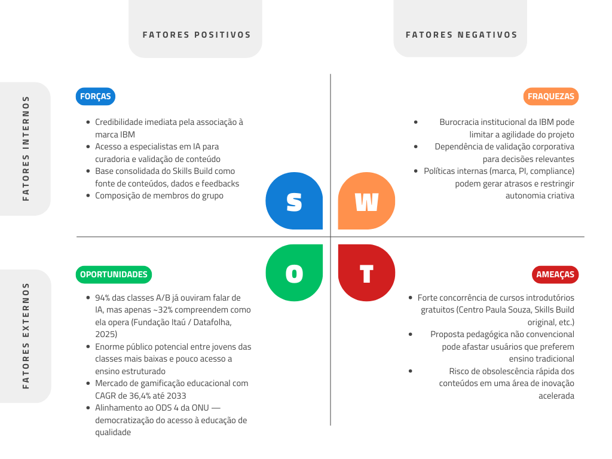
Fonte: Autoria própria (2026).  

**Forças**

As principais forças do projeto decorrem da parceria com a IBM, conferindo, por exemplo, credibilidade imediata ao jogo e contato com especialistas em IA, garantindo rigor técnico e relevância no aprendizado. Além da base já consolidada do Skills Build, que traz um eixo de conteúdos e dados para se apoiar. Soma-se a isso a própria composição da equipe, formada por integrantes que fazem parte do público-alvo e com diferentes níveis de conhecimento em IA, possibilitando testar internamente a clareza e a eficácia da abordagem pedagógica do jogo, validando o processo de ensino a partir da própria experiência de aprendizagem do grupo.

**Fraquezas**

As fraquezas são, em boa medida, o reverso das forças. A vinculação a uma big tech consolidada traz consigo processos burocráticos que podem ser restritivos para um projeto em fase inicial. Toda decisão relevante depende de validação institucional da IBM, o que pode comprometer a agilidade necessária nas primeiras etapas de desenvolvimento. Há também uma dependência de dados e de políticas internas da empresa — como regras de uso de marca, propriedade intelectual e compliance — que podem gerar atrasos e limitar a autonomia criativa da equipe.

**Oportunidades**

O crescimento acelerado do mercado de IA, aliado à lacuna de conhecimento no Brasil, representa uma grande oportunidade. Embora a maioria da população já tenha ouvido falar em IA e 75% afirmem utilizá-la no cotidiano, poucos sabem defini-la corretamente, revelando um amplo público potencial — especialmente entre jovens das classes C, D e E. Paralelamente, o mercado de gamificação educacional está em forte expansão, com projeções bilionárias e alto crescimento anual. Nesse cenário, um jogo educativo sobre IA nos posiciona como early adopters e contribui para democratizar o acesso ao conhecimento, alinhando-se ao ODS 4 da ONU ⁴.

**Ameaças**

A principal ameaça é a concorrência. Uma busca simples por "curso introdutório de IA" no Google retorna diversas opções gratuitas — como o curso do Centro Paula Souza —, e o próprio Skills Build original pode ser percebido como alternativa mais direta e tradicional. O fato de o jogo adotar uma abordagem pedagógica diferenciada é ao mesmo tempo um diferencial e um risco, já que parte do público pode preferir métodos de ensino convencionais, especialmente num primeiro contato com o tema. Outra ameaça relevante é a velocidade de obsolescência dos conteúdos. Em uma área em que avanços disruptivos ocorrem em questão de meses, manter o jogo atualizado exigirá um processo contínuo de revisão, o que representa um custo operacional significativo ⁴.

### 1.1.3. Missão / Visão / Valores (sprint 2)

**Missão:**

Democratizar o acesso a conhecimentos sobre de IA para jovens de todas as classes sociais através da gamificação com um jogo web de fácil acesso ⁸.

**Visão:**

Ser um modelo nacional na implementação da gamificação para educação de IA de maneira inclusiva. 

**Valores:**

Educação lúdica, democratização da IA, inovação pedagógica, aprendizado por descoberta, lisura e ética em IA.

### 1.1.4. Proposta de Valor (sprint 4)

*Posicione aqui o canvas de proposta de valor. Descreva os aspectos essenciais para a criação de valor da ideia do produto com o objetivo de ajudar a entender melhor a realidade do cliente e entregar uma solução que está alinhado com o que ele espera.*

## A. Perfil do Cliente

## Público-alvo principal
Estudantes universitários e jovens com baixo letramento em IA.

## a) Tarefas do cliente (Customer Jobs)

- Aprender conceitos de IA (machine learning, redes neurais, IA generativa)
- Aplicar conhecimento na prática
- Aprender sobre ética em IA
- Adquirir letramento básico em IA sem precisar de base teórica avançada
- Acompanhar tendências tecnológicas

## b) Dores (Pains)

- Baixo engajamento em cursos assíncronos ¹¹
- Excesso de conteúdo teórico
- Dificuldade de aplicação prática
- Evasão em cursos online
- Falta de conhecimento sobre os principais motivos da evasão
- Desorientação em relação à IA
- Pouco conhecimento dos termos relacionados à IA
- Não saber exatamente o que é IA
- Medo em relação ao futuro da IA
- Falta de motivação devido à ausência de progressão visível

## c) Ganhos (Gains)

- Aprendizado interativo e aplicado
- Experiência imersiva
- Maior retenção de conhecimento
- Facilidade de compreensão de conceitos complexos
- Entendimento geral sobre IA
- AI literacy
- Capacidade de aproveitar ganhos de produtividade com IA
- Analogia entre a progressão da história e os aprendizados
- Maior foco e motivação

## B. Mapa de Valor

## a) Produtos e Serviços

- Jogo digital educacional baseado em IA com narrativa engajante
- Módulos gamificados (níveis, desafios e simulações)
- Experiências inspiradas no IBM SkillsBuild
- Sistema de progressão gradual
- Puzzles interativos que permitem ao jogador visualizar e interagir com o que está aprendendo
- Conteúdos complexos atuais condensados e simplificados para favorecer aprendizagem e engajamento

## b) Aliviadores de Dores ⁹

- Substituição de conteúdo passivo por interação ativa
- Simulação prática de conceitos
- Feedback imediato
- Transformação de conceitos abstratos em interações concretas
- Uso de microdesafios para aumentar o engajamento
- Visualização de processos relacionados à IA
- Criação de um índice que identifique os critérios de evasão, permitindo monitoramento e ajustes contínuos

## c) Criadores de Ganho

- Narrativa imersiva
- Progressão por níveis ¹⁰
- Aplicação prática dos conceitos
- Puzzles sobre IA

### 1.1.5. Descrição da Solução Desenvolvida (sprint 4)

A solução desenvolvida consiste em um jogo educativo web gamificado voltado ao ensino introdutório de Inteligência Artificial, integrado ao contexto do IBM SkillsBuild. O projeto parte do diagnóstico de que os cursos online tradicionais sofrem com baixo engajamento, altas taxas de evasão e um modelo de aprendizado predominantemente passivo, incapaz de manter o interesse de jovens iniciantes. Esse problema é agravado pela natureza excessivamente técnica de grande parte do conteúdo sobre IA disponível, criando uma barreira de entrada significativa para o público-alvo identificado: jovens universitários de renda média-baixa, egressos de escola pública, com familiaridade cotidiana com tecnologia mas sem formação técnica formal na área.

A resposta a esse cenário é uma experiência narrativa e interativa protagonizada por Sophia, cientista que desperta em 2098 após décadas em criogenia, encontrando um mundo devastado pelo uso indevido de Inteligências Artificiais. Acompanhada pelo robô Asimov, ela precisa restaurar o laboratório em ruínas e reconstruir sistemas de IA com responsabilidade. Esse enredo contribui com o jogo, de modo que cada fase da jornada corresponde a um conceito real de Inteligência Artificial, transformando o aprendizado em consequência direta da progressão narrativa.

A primeira fase introduz ao jogador o conceito fundamental de reconhecimento de padrões em máquinas. O jogador assume o controle de Asimov e o guia por um percurso repleto de obstáculos, utilizando as teclas direcionais para mover o robô para cima e para baixo entre as faixas do cenário e a barra de espaço para realizar saltos. O intuito pedagógico é explícito, no qual ao executar esses desvios repetidamente, o jogador vivencia, na perspectiva do robô, o processo pelo qual uma máquina identifica e responde a padrões no ambiente, fundamento sobre o qual toda a Inteligência Artificial moderna se apoia.

Ao concluir esse percurso, Asimov encontra um baú com pistas sobre o cristal de energia necessário para restaurar o laboratório. No entanto, as informações que levam até ele estão escondidas atrás de uma das portas do laboratório, e nem Sophia nem Asimov sabem qual é a correta. Para resolver esse problema, o jogador acessa o processamento interno de Asimov e alimenta sua rede neural com três valores binários que representam, respectivamente, a cor da porta, sua identificação e o padrão de sua maçaneta. Esses valores são inseridos nos neurônios de entrada da rede, e o jogador clica nos nós da camada oculta para ativar o processamento. A partir disso, o próprio jogo exibe uma animação que representa o aprendizado da rede ao longo das épocas de treinamento, tornando visível um processo que normalmente permanece opaco. Em seguida, o jogador precisa acionar a Válvula Softmax, que representa a camada de ativação responsável por converter as saídas brutas da rede em probabilidades interpretáveis, e regular o valor de saída até que Asimov consiga identificar a porta correta com confiança suficiente¹⁴.

Ao abrir a porta, o chão cede e Sophia cai em um ambiente inferior. Para retornar, o jogador precisa subir por plataformas saltando entre elas, e ao longo desse percurso coleta documentos com imagens de cristais verdadeiros. Essa fase introduz a visão computacional e a lógica do seu treinamento, ou seja,  quanto mais imagens corretas Sophia recolhe, mais preciso será o sistema que guiará Asimov na etapa seguinte. A mecânica de coleta transmite de forma intuitiva o princípio de que a qualidade e a quantidade de dados de treino determinam a capacidade de um modelo de reconhecer corretamente o que lhe é apresentado ¹⁶ .

Na quarta fase, Asimov já possui as informações coletadas e inicia a geração interna de uma projeção do cristal. Contudo, o processo produz ruídos, imperfeições visuais que distorcem a imagem gerada. O jogador utiliza o cursor do mouse como se fosse uma esponja e arrasta-o sobre as manchas e distorções que aparecem na projeção, eliminando progressivamente as falhas até que a imagem atinja nitidez suficiente. Essa mecânica materializa dois conceitos centrais da IA moderna: o funcionamento de modelos generativos, que produzem saídas a partir de padrões aprendidos, e o problema do overfitting, em que ruídos e interferências nos dados de treinamento comprometem a qualidade do resultado gerado. O jogador não lê sobre esses conceitos ele usa-os com o mouse como se fosse a própria IA.

Com o cristal sintetizado, Sophia o transporta até o centro do laboratório para realizar a restauração final. Nesse momento, antes de depositar o cristal no núcleo energético, o jogador é confrontado com uma série de perguntas éticas sobre o uso da Inteligência Artificial, precisando clicar nas respostas corretas para concluir o jogo. Essa etapa posiciona a ética não como fator primordial e como condição de desfecho, pois o laboratório só é restaurado quando o jogador demonstra compreender que a tecnologia, por si só, não determina seus impactos. Quem a direciona, e com quais valores, é o que define se ela reconstrói ou destrói¹⁵.

A escolha por plataforma web, desenvolvida com HTML5, JavaScript e Phaser, elimina a necessidade de instalação e garante acesso imediato via navegador, reduzindo uma barreira relevante para o perfil socioeconômico do público-alvo. A progressão linear e sequencial entre as fases, na qual cada etapa só é desbloqueada após a conclusão da anterior, garante que o jogador construa gradualmente os conceitos antes de avançar, evitando que a experiência se torne superficial. A criação de valor do produto está em converter conceitos como reconhecimento de padrões, redes neurais, softmax, visão computacional, modelos generativos e ética em IA em ações concretas que o jogador executa e compreende pelo fazer, ampliando o alcance do IBM SkillsBuild a um público que dificilmente seria atingido por plataformas textuais tradicionais e contribuindo para a democratização do letramento em Inteligência Artificial.

### 1.1.6. Matriz de Riscos (sprint 4)

As escalas utilizadas consideram, para probabilidade, os valores 10 como muito improvável, 30 como baixa, 50 como média, 70 como alta e 90 como muito alta. Para impacto, a classificação varia entre muito baixo, quando o impacto é irrelevante, baixo, quando afeta aspectos pontuais, moderado, quando prejudica a experiência, alto, quando prejudica significativamente o projeto, e muito alto, quando compromete o objetivo central.

No grupo de riscos muito altos, o R1 – Riscos Pedagógicos apresenta probabilidade 90 e impacto muito alto. Trata-se de um risco crítico de que o conteúdo educacional não gere aprendizado real, seja por inadequação ao nível do público, com excesso de abstração ou simplificação, falta de progressão lógica ou ausência de reforço prático. Isso pode resultar em baixa retenção, dificuldade de aplicação prática e sensação de não aprendizado, comprometendo a função central do projeto e gerando abandono e descrédito. Como plano de ação, propõem-se testes com usuários iniciantes e ajuste de ritmo e profundidade. Os indicadores incluem retenção de conhecimento e taxa de conclusão. Como oportunidade atrelada ao risco, há o desenvolvimento de um modelo pedagógico original baseado em aprendizagem ativa e simulação, integrando prática imediata, feedback contínuo, gamificação e storytelling.

Entre os riscos altos, o R2 - Complexidade na Simulação de IA apresenta probabilidade 50 e impacto muito alto. Há o risco de que a simulação de conceitos de IA se torne tecnicamente complexa a ponto de comprometer a clareza com que os usuários compreendem o conteúdo ou a própria viabilidade de transpor esses conceitos para o jogo, gerando abstrações confusas, simplificações incorretas ou dificuldades de implementação, o que pode resultar em experiências inconsistentes ou erros conceituais. O plano de ação envolve prototipagem iterativa e validação com especialistas, com indicadores voltados tanto à compreensão dos usuários quanto ao feedback técnico. Como oportunidade, destaca-se a criação de uma base simplificada e reutilizável para simulações educacionais de IA.

O R3 – Riscos Estratégicos para a IBM apresenta probabilidade 50 e impacto muito alto. Há a possibilidade de o projeto não gerar valor estratégico claro, seja por desalinhamento com os objetivos institucionais, baixa diferenciação ou limitada aplicabilidade prática, o que pode resultar na perda de apoio ou até na descontinuidade — um problema crítico, considerando a dependência direta do projeto em relação à IBM e à sua validação. Como plano de ação, propõe-se a definição clara da proposta de valor e a realização de benchmark, com indicadores voltados à percepção de valor e à comparação com alternativas, permitindo validar e demonstrar continuamente a relevância do projeto para a IBM. Como oportunidade, destaca-se o potencial de posicionar o projeto como referência em educação em IA para públicos iniciantes.

O R4 – Desalinhamento com o SkillsBuild possui probabilidade 30 e impacto muito alto. Mesmo com alinhamento inicial, pode haver divergência ao longo do desenvolvimento entre o produto e os objetivos pedagógicos da plataforma, gerando retrabalho ou necessidade de reestruturação. O plano de ação envolve revisões por sprint e mapeamento com o currículo, com indicadores de aderência ao conteúdo e aprovação da IBM. A oportunidade está em explorar liberdade criativa para inovar dentro da plataforma.

Entre os riscos moderados, o R5 – Engajamento e Entretenimento apresenta probabilidade 70 e impacto moderado. Há o risco de o produto não se mostrar suficientemente envolvente, seja por mecânicas repetitivas ou pela ausência de recompensas claras, o que pode levar ao abandono precoce por parte dos usuários. Como plano de ação, propõem-se testes de gameplay e a iteração contínua das mecânicas, utilizando indicadores como tempo de sessão e taxa de abandono, sempre com participantes alinhados ao público-alvo do projeto — jovens universitários. Por outro lado, há uma oportunidade relevante em desenvolver um sistema de engajamento baseado em progressão e feedback imediato, capaz de aumentar a retenção e a experiência do usuário.

O R6 – Curva de Aprendizado Inadequada apresenta probabilidade 70 e impacto moderado. Há o risco de a dificuldade escalar de maneira desbalanceada, gerando frustração ou tédio e comprometendo tanto o fluxo de aprendizagem quanto o engajamento do usuário. Como plano de ação, propõe-se o ajuste contínuo da dificuldade do jogo com base em indicadores como tempo por fase e taxa de desistência, considerando testes com jogadores alinhados ao público-alvo. Como oportunidade, destaca-se a implementação de um sistema adaptativo capaz de personalizar a experiência de aprendizado conforme o desempenho do usuário.

O R7 – Experiência do Usuário, UX e UI apresenta probabilidade 50 e impacto moderado. Interfaces confusas ou pouco intuitivas podem dificultar a navegação e o entendimento, gerando fricção e erros. O plano de ação envolve testes de usabilidade, com indicadores como erros de navegação e tempo de aprendizado. A oportunidade é desenvolver uma experiência altamente orientada à aprendizagem, reduzindo a carga cognitiva desnecessária.

O R8 – Obsolescência do Conteúdo tem probabilidade 50 e impacto moderado. A rápida evolução da IA pode tornar o conteúdo desatualizado, reduzindo relevância e credibilidade. O plano de ação consiste em atualizações periódicas, com indicador de atualidade. A oportunidade é criar uma arquitetura modular e atualizável.

O R9 – Storytelling Desconectado apresenta probabilidade 50 e impacto moderado. A narrativa pode não se integrar bem aos objetivos educacionais, reduzindo imersão e retenção. O plano de ação é a integração narrativa, com indicadores de clareza percebida e índice de conclusão. A oportunidade está em usar storytelling como suporte direto ao aprendizado.

O R10 – Falta de Valor para o Usuário possui probabilidade 50 e impacto moderado. Os usuários podem não perceber valor claro no produto, impactando adoção e engajamento. O plano de ação envolve testes de percepção, com indicadores como NPS¹⁷ e satisfação. A oportunidade é entregar valor tangível em forma de habilidades e compreensão real de IA.

Por fim, nos riscos baixos, o R11 – Riscos de Design apresenta probabilidade 30 e impacto baixo. Elementos visuais podem não atingir o nível ideal de qualidade estética ou consistência, afetando a percepção de profissionalismo, mas sem comprometer a funcionalidade. O plano de ação é a iteração visual, com indicador de feedback qualitativo. A oportunidade está na construção de uma identidade visual marcante e coerente.

### 1.1.7. Objetivos, Metas e Indicadores (sprint 4)

Os objetivos estratégicos do projeto concentram-se em ampliar o engajamento de jovens com pouco conhecimento em Inteligência Artificial, por meio da criação de uma experiência interativa mais atraente do que cursos tradicionais, incentivando a continuidade de uso. Paralelamente, busca-se aprimorar a aprendizagem de conceitos básicos de IA, garantindo que o usuário compreenda temas como reconhecimento de padrões, classificação de dados e noções iniciais de machine learning. Outro objetivo central é despertar o interesse pela área, fazendo com que o usuário perceba a IA como algo acessível e estimulante para estudos futuros, além de incentivar a conclusão do jogo por meio de elementos narrativos e mecânicas capazes de sustentar o engajamento até o final da experiência.

No que se refere às metas estabelecidas, a M1 propõe alcançar, em até quatro semanas após o lançamento, uma taxa de conclusão de pelo menos setenta por cento entre os usuários que iniciarem o jogo. A M2 busca reduzir a evasão nas fases iniciais, estabelecendo como limite máximo trinta por cento de abandono antes da terceira fase, de modo a garantir o engajamento efetivo dos jogadores já nas duas primeiras semanas após o lançamento. A M3 está relacionada à satisfação do usuário, com o objetivo de que ao menos cinquenta por cento dos jogadores que concluírem o jogo o compartilhem e incentivem novos usuários a jogá-lo, no prazo de até duas semanas após a conclusão. Por fim, a M4 visa assegurar a continuidade do aprendizado, garantindo que ao menos trinta por cento dos usuários que finalizarem o jogo acessem outros conteúdos educacionais do IBM SkillsBuild.

Para acompanhar o desempenho e o alcance dessas metas, foram definidos indicadores-chave. O KPI 1 mede a taxa de conclusão, isto é, a proporção de usuários que finalizam o jogo em relação aos que o iniciaram, com meta de pelo menos setenta por cento, sendo avaliado após duas semanas e com foco em engajamento. O KPI 2 avalia a taxa de abandono, mensurando quantos usuários desistem antes de concluir o jogo, com meta de no máximo trinta por cento, sendo analisado por fase e de forma acumulada, também com foco em engajamento.

Além disso, o KPI 3 analisa o tempo médio de uso, mensurando quanto tempo o usuário leva para concluir o jogo, com meta de pelo menos vinte minutos, a fim de garantir que o jogador de fato interaja com a experiência e se engaje. O KPI 4 mede o alcance dos compartilhamentos do jogo, identificando quantos usuários iniciaram a experiência a partir da recomendação de outros, com meta de pelo menos cinquenta por cento de novos usuários provenientes de divulgação orgânica em até um mês, com foco em satisfação e alcance. O KPI 5 avalia a satisfação do usuário, mensurando o quanto os jogadores recomendariam o jogo, com meta de pelo menos sessenta por cento de recomendações, sendo coletado após a conclusão e focado na experiência do usuário. Por fim, o KPI 6 mede a continuidade do aprendizado, verificando quantos usuários acessam o IBM SkillsBuild após finalizar o jogo, com meta de pelo menos trinta por cento em até trinta dias, refletindo o impacto educacional da solução.

## 1.2. Requisitos do Projeto (sprints 1 e 2)

\# | Requisito  
--- | ---
1 | O jogo é iniciado com um toque em qualquer local da tela inicial.
2 | O controle do personagem será realizado usando as teclas direcionais (→ ↑ ↓ ←) para navegação e a  interação com itens presentes no jogo será realizada com a tecla E.
3 | A ação de pular é realizada utilizando a tecla SPACE.
4 | A tela do mapa ficará com brilho baixo a não ser perto do personagem, onde haverá uma luz que o acompanha para que o jogador tenha a sensação de estar explorando o ambiente. 
5 | O robô acompanhará o jogador durante a movimentação após a primeira fase do jogo.
6 | Haverá uma barra de progresso na tela para que o jogador saiba o nível do conhecimento adquirido.
7 | No decorrer do jogo o jogador desbloqueará conquistas a cada fase, que simbolizarão o conhecimento adquirido e apenas com todas elas ele poderá desbloquear a fase final.
8 | Na cena inicial, o jogador só poderá interagir com a camâra de criogênia após interagir com o NPC Watson.

## 1.3. Público-alvo do Projeto (sprint 2)

O público-alvo do jogo são jovens universitários com pouco ou nenhum contato aprofundado com tecnologia — especialmente com Inteligência Artificial. A maioria dessas pessoas limita sua experiência de AI ao uso casual de chatbots como ChatGPT, Gemini ou Claude, o que reflete bem a realidade, em que pesquisas, por exemplo, indicam que menos de 30% das empresas nos EUA de fato adotaram IA em seus processos, evidenciando que a expertise do grande público nessa área é frequentemente superestimada. Por ser um jogo introdutório, ele se encaixa tanto para estudantes de cursos que demandam apenas um uso superficial de IA quanto para calouros de cursos como Ciência da Computação, Engenharia de Software ou Engenharia da Computação que ainda não tiveram uma base sólida no tema, funcionando de forma análoga ao pré-cálculo adotado por diversas universidades para nivelar estudantes com lacunas matemáticas, mas para o uso de AI e sendo muito mais divertido e engajante ⁵.

O perfil mais representativo do nosso usuário é o de um jovem de renda média-baixa, criado fora dos grandes centros urbanos e egresso de escola pública, levando em conta que mais de 80% dos estudantes do ensino médio brasileiro vem de escolas públicas, o público potencial do jogo seria bem grande. Esse usuário potencial do jogo tem afinidade e desenvoltura com tecnologias acessíveis do cotidiano, como celulares e videogames, mas nunca teve a oportunidade de se aprofundar tecnicamente. Agora, ao ingressar na universidade, enfrenta pela primeira vez a necessidade de desenvolver uma compreensão mais sólida da área, e é exatamente para esse primeiro passo que o jogo foi pensado ⁶.

# 2. Visão Geral do Jogo (sprint 2)

## 2.1. Objetivos do Jogo (sprint 2)

O objetivo do jogo é restaurar o funcionamento do laboratório e proteger os dados essenciais para a humanidade. O objetivo lusório consiste em alcançar esse resultado respeitando as regras e limitações impostas pelo jogo, como desviar de obstáculos, resolver puzzles e utilizar corretamente as mecânicas específicas de cada fase, incluindo os controles de movimentação e os minigames propostos.

Além do objetivo narrativo e lusório, o projeto também possui um propósito educacional de apresentar conceitos básicos de Inteligência Artificial de forma interativa. Por meio das mecânicas, desafios e situações enfrentadas durante a gameplay, o jogador entra em contato com fundamentos de IA, como reconhecimento de padrões e tomada de decisão, adquirindo fluência básica no tema, além de estimular o interesse de estudantes universitários pela área e incentivar a busca por iniciativas educacionais relacionadas, como os próprios cursos oferecidos pelo IBM SkillsBuild.

## 2.2. Características do Jogo (sprint 2) 

O jogo é uma historia repleta de acão onde a protagonista deverá passar por desafios e durantes eles irá aprender sobre os fundamentos basicos da IA. O jogo tem graficos simples feitos no Piskel. Os personagens são a peca chave para o jogo, todos tem um contexto, historia e motivacões, assim deixando o jogador mais conectado com o jogo. 

### 2.2.1. Gênero do Jogo (sprint 2)

O gênero do nosso jogo é de aventura, tendo modo história, ação e puzzles, tudo isso com o objetivo de ensinar.

### 2.2.2. Plataforma do Jogo (sprint 2)

O jogo será desenvolvido para plataforma Web, sendo executado diretamente no navegador por meio do framework Phaser, utilizando tecnologias baseadas em HTML5 e JavaScript. O acesso ocorrerá por meio de um link, sem necessidade de instalação prévia do jogo.

A experiência foi projetada principalmente para computadores (desktop e notebook) que utilizem sistemas operacionais como Windows, macOS ou Linux, desde que possuam um navegador moderno atualizado (como Chrome, Safari, Edge ou Firefox) compatível com aplicações em HTML5.

Embora o site possa ser acessado também por dispositivos móveis, o jogo não foi desenvolvido com interface responsiva, pois os controles utilizam teclado e mouse para movimentação e interação.

### 2.2.3. Número de jogadores (sprint 2)

Apenas um jogador. Nosso jogo é uma história onde apenas 1 jogador é controlável, a nossa protagonista Sophia.

### 2.2.4. Títulos semelhantes e inspirações (sprint 2)

Nós nos inspiramos em jogos baseados em minigames (o jeito que nós iremos ensinar o usuário) , Hollow Knight (Design, como a luz em torno do personagem), Spaceship Runner e Among Us ( Gráfico e puzzles) , a inteligência artificial Learn Ia (Desenvolvimento de habilidades de IA, baseado em textos).

### 2.2.5. Tempo estimado de jogo (sprint 5)

*Ex. O jogo pode ser concluído em 3 horas passando por todas as fases.*

*Ex. cada partida dura até 15 minutos*

# 3. Game Design (sprints 2 e 3)

## 3.1. Enredo do Jogo (sprints 2 e 3)

Em um mundo onde a Inteligência Artificial ainda está em fase de desenvolvimento, surge a constante indagação sobre como essa tecnologia afetará o futuro da sociedade. A narrativa tem início em 2022, em um laboratório de pesquisa focado em aprendizado de máquina e robótica, repleto de profissionais renomados. Entre eles destaca-se Sophia, uma cientista brilhante reconhecida por sua curiosidade inata, mente analítica e criatividade na resolução de problemas. À frente do laboratório está Watson, cientista-chefe e orientador de Sophia, responsável por coordenar os projetos mais ambiciosos da equipe.

À medida que os sistemas evoluem, Watson começa a perceber um risco crescente: a tecnologia criada para auxiliar a humanidade poderia ser facilmente redirecionada para fins de controle e destruição. Ele identifica movimentações externas interessadas em assumir o comando dos projetos e teme que, no futuro, as IAs desenvolvidas no laboratório sejam treinadas para atender interesses de dominação. Sem conseguir interromper o avanço inevitável das pesquisas nem garantir que permaneceriam sob controle ético, Watson elabora um plano extremo.

Ele convoca Sophia para uma conversa reservada e apresenta projeções alarmantes baseadas em simulações internas do próprio laboratório. O diálogo gira em torno do perigo iminente que as criações dos agentes robóticos autônomos projetados para automatizar tarefas humanas, do laboratório, podem representar no futuro. Com a idade avançada, Watson tem um mau pressentimento: ele teme que a liderança do projeto caia em mãos erradas e que a tecnologia seja utilizada para ganho de poder e dominação.

Para evitar esse cenário trágico, o líder convence Sophia a passar por um processo de criogenia. Seu corpo seria totalmente congelado para despertar apenas em 2098, tornando-se a esperança de um final promissor para o destino das máquinas inteligentes. Embora receosa, a cientista aceita, pois dedicou toda a sua vida à ciência. Assim que o procedimento é iniciado, Watson ativa um protocolo secreto: caso um cenário de calamidade fosse detectado, um agente específico deveria despertar Sophia.

Esse agente é Asimov, um robô criado como experimento científico avançado para testes de aprendizagem autônoma e suporte operacional ao laboratório. Projetado para auxiliar equipes humanas de forma independente, Asimov possui arquitetura adaptativa e capacidade de evolução contínua por meio de dados.

Muitas décadas depois, a câmara criogênica se abre. Sophia desperta em 2098, em um mundo devastado pelo uso indevido de Inteligências Artificiais treinadas para obter poder e dominação. O antigo laboratório está em ruínas, tomado por sucatas e falhas estruturais. Asimov foi o responsável por ativar o protocolo de despertar sophia ao detectar a calamidade global, cumprindo a última ordem direta de Watson. No entanto, ele também sofreu danos: parte de sua memória foi fragmentada e seu banco de dados encontra-se inacessível devido à falha no núcleo energético do mapa central do laboratório.

Ao analisar os sistemas restantes, Asimov explica que a única maneira de restaurar a infraestrutura e recuperar integralmente seu banco de dados é reativar o núcleo do mapa energético do laboratório. Para isso, é necessário um cristal específico, capaz de armazenar e redistribuir grandes cargas de energia para toda a estrutura. Sem essa fonte, o laboratório permanecerá inoperante e seu conhecimento perdido.

A busca começa na área de sucatas, onde podem existir registros antigos sobre o cristal. O ambiente, porém, está excessivamente poluído, tornando a entrada arriscada para Sophia. Além disso, Asimov perdeu parte de seus módulos de navegação e desvio de obstáculos. Para superar essa limitação, Sophia assume o controle remoto do robô, guiando-o manualmente pelos destroços. Ao concluir essa etapa, Asimov reaprende padrões de locomoção e recupera sua capacidade básica de navegação.

Entre os escombros, encontram um baú contendo a imagem de uma porta específica e seus padrões codificados em binário. A próxima fase consiste em localizar essa porta em uma sala com múltiplos caminhos e entradas visualmente semelhantes. O ambiente é escuro demais para Sophia distinguir os detalhes, mas Asimov consegue enxergar na ausência de luz. No entanto, ele não consegue diferenciar os padrões corretos. Sophia então o treina por meio de um sistema de reconhecimento de padrões, ensinando-o a classificar corretamente as características visuais até que ele consiga identificar a porta certa de forma independente.

Ao atravessarem a entrada certa, encontram um novo conjunto de dados: imagens e registros de cristais raros, divididos entre exemplares verdadeiros e falsos. Os cristais adequados são azuis, pontiagudos e altamente brilhantes, capazes de armazenar grandes cargas de energia; os inadequados apresentam colorações avermelhadas, rachaduras e irregularidades estruturais. Sophia precisa organizar esse banco de dados, separando corretamente as amostras e levando-as a um extrator de características. A partir disso, é criado um mapa de atributos que será inserido no sistema de Asimov.

Essas informações são inseridas em Asimov, que passa por um novo processo de aprendizado, simulando o comportamento de uma rede neural generativa. Ele começa a produzir múltiplas variações com ruídos e interferências. Cabe a Sophia ajustar os parâmetros, reduzir os níveis de erro e limpar as distorções até que o sistema gere um cristal idêntico ao modelo verdadeiro. Com o padrão final validado, o cristal é forjado e colocado no núcleo do mapa energético do laboratório. A energia da instalação é restaurada, reativando sistemas essenciais e recuperando integralmente o banco de dados de Asimov. Com sua capacidade de processamento ampliada e acesso total às informações originais, ele se torna novamente um agente autônomo avançado, pronto para auxiliar Sophia na reconstrução do conhecimento perdido.

O jogo encerra-se com um desfecho aberto. A restauração do laboratório representa apenas o primeiro passo. Sophia compreende que o problema nunca foi a tecnologia em si, mas a forma como ela é direcionada. Agora, ao lado de Asimov, ela inicia uma nova etapa: reconstruir sistemas inteligentes com responsabilidade, refletindo sobre o uso ético da Inteligência Artificial e deixando ao jogador a sensação de que o verdadeiro desafio começa a partir dali.

## 3.2. Personagens (sprints 2 e 3)

### 3.2.1. Controláveis

### SOPHIA

Sophia é uma das personagens controláveis e protagonista da narrativa. Cientista formada no laboratório liderado por Watson, destaca-se por sua inteligência analítica, curiosidade científica e capacidade de resolver problemas complexos. Ao despertar em 2098, encontra um mundo devastado pelo uso indevido da Inteligência Artificial e precisa utilizar suas habilidades em programação, análise de dados e reconstrução de sistemas para restaurar o laboratório. Ao longo do jogo, Sophia evolui de pesquisadora dependente do suporte tecnológico para uma agente ativa na reconstrução do conhecimento, assumindo decisões estratégicas, treinando modelos de IA e conduzindo processos de síntese e classificação que impactam diretamente a progressão da história.

Figura 2: Sprite de Sophia, a personagem principal. 
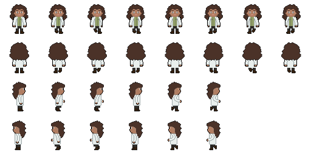 
Fonte: Autoria própria (2026).  

### ASIMOV

Asimov também é personagem controlável em momentos específicos da jogabilidade. Criado originalmente como um experimento científico avançado para atuar como agente autônomo de suporte ao laboratório, ele possui arquitetura adaptativa e capacidade de aprendizado contínuo. Após décadas de abandono e danos estruturais, desperta Sophia seguindo a última ordem de Watson, mas apresenta falhas em memória e sistemas de navegação. Durante o jogo, o jogador assume o controle de Asimov na fase 1, enquanto seus sistemas são gradualmente restaurados por meio de treinamentos e inserção de dados. Sua evolução acompanha o avanço técnico da narrativa, tornando-se progressivamente mais autônomo e estratégico, consolidando-se como parceiro essencial na reconstrução do laboratório e na restauração do equilíbrio tecnológico.

Figura 3: Sprite de asimov, personagem secundário. 
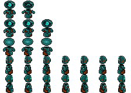 
Fonte: Autoria própria (2026).  

### 3.2.2. Non-Playable Characters (NPC)

### WATSON

Watson é o principal personagem não controlável da narrativa. Cientista-chefe do laboratório e orientador de Sophia em 2022, ele é o responsável por liderar os projetos de Inteligência Artificial que impulsionam a história. Visionário e experiente, Watson antecipa os riscos do uso indevido da tecnologia e toma a decisão crucial de submeter Sophia à criogenia como medida extrema para preservar o conhecimento original do laboratório. Antes do congelamento, ele programa em Asimov o protocolo de despertar, garantindo que, em caso de calamidade, Sophia teria a oportunidade de restaurar o equilíbrio perdido.

Embora não esteja presente fisicamente no futuro, Watson exerce forte influência sobre a narrativa por meio de registros, instruções deixadas nos sistemas e pelas consequências de suas decisões. Ele funciona como catalisador da jornada, sendo a figura que inicia os acontecimentos que estruturam todo o arco do jogo.

Figura 4: Sprite de Watson, NPC. 
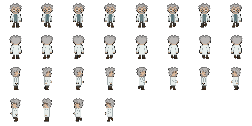 
Fonte: Autoria própria (2026).  

### 3.2.3. Diversidade e Representatividade dos Personagens

A construção dos personagens foi pensada para dialogar diretamente com o público-alvo: estudantes universitários interessados em Inteligência Artificial que buscam uma abordagem mais aplicada e menos teórica. A partir disso, foram analisados aspectos sociais relacionados ao público presente na área de tecnologia.

Mundialmente, cerca de 41% das mulheres deixam suas profissões de tecnologia justamente pelo fato dos ambientes de trabalho não serem inclusivos, o que prejudica a representatividade feminina em posições de liderança (Struckman, 2019). Diante disso, foram analisadas estatísticas sobre a presença feminina e referências na área.

De acordo com uma pesquisa realizada pela CNN Brasil, 83,3% do mercado é composto por homens, enquanto as mulheres ocupam apenas 12,3% dos cargos de tecnologia e somente 35% da mão-de-obra feminina de tecnologia ocupa cargos de liderança (Catho, 2021). Assim, em discussões, foi decidido fazer uma representação de uma mulher em uma posição de liderança na área de tecnologia, nossa personagem central na trama: Sophia. 

Ademais, também foi analisada uma pesquisa realizada em 2022 pelo PretaLab, as mulheres negras representam 28% da sociedade brasileira, onde 11% trabalham em empresas de tecnologia e apenas 3% estão matriculadas em cursos de pós-graduação. Para criação dessa personagem, foi tomada como inspiração Sônia Guimarães, pioneira entre as mulheres negras na ciência brasileira.

Em uma área historicamente marcada pela desigualdade de gênero, ela ocupa o lugar de protagonista técnica, estrategista e agente da reconstrução científica. Não é retratada como coadjuvante, mas como responsável pelas decisões críticas, pelo treinamento dos sistemas e pela restauração do laboratório. Sua trajetória simboliza a luta e a consolidação das mulheres em espaços de pesquisa, liderança e inovação, funcionando como referência positiva para jogadoras e jogadores. Além disso, Sophia representa o estudante que aprende pela prática: evolui ao testar hipóteses, ajustar modelos e corrigir falhas, demonstrando que o domínio da IA é construído progressivamente.

Asimov representa a dimensão tecnológica contemporânea. Ele simboliza as ferramentas de apoio ao aprendizado, como plataformas educacionais, ambientes de programação e sistemas inteligentes, que ampliam a capacidade humana sem substituir o raciocínio crítico. Sua evolução ao longo do jogo reforça a ideia de que tecnologia e ser humano devem atuar de forma complementar e ética.

Watson, por sua vez, representa a tradição científica e a responsabilidade institucional. Como cientista-chefe e orientador, ele simboliza a importância da pesquisa estruturada, da formação sólida e da reflexão ética no desenvolvimento tecnológico.

Dessa forma, o jogo promove representatividade de gênero, acadêmica e profissional, posicionando a ciência como espaço acessível, diverso e em constante transformação. A narrativa reforça que o avanço da Inteligência Artificial depende não apenas de inovação técnica, mas também de diversidade, responsabilidade e formação crítica.

## 3.3. Mundo do jogo (sprints 2 e 3)

### 3.3.1. Locações Principais e/ou Mapas (sprints 2 e 3)

O jogo se passa em um laboratório de pesquisa em Inteligência Artificial e robótica. No início da narrativa, em 2022, o ambiente é apresentado como um espaço moderno, organizado e equipado com tecnologias avançadas, transmitindo a sensação de progresso científico e inovação. Após o salto temporal para 2098, quando Sophia desperta da criogenia, o jogador encontra o mesmo laboratório em estado de abandono, com estruturas danificadas, equipamentos quebrados e um ambiente escuro e silencioso, reforçando as consequências do uso indevido da tecnologia ao longo das décadas.

Entre os principais ambientes explorados está a área de sucatas, um setor do laboratório onde foram acumulados equipamentos danificados, peças de robôs e restos de experimentos antigos. Esse espaço funciona como uma área inicial de exploração, onde Sophia controla Asimov para navegar entre os destroços e encontrar pistas sobre a localização do cristal necessário para restaurar os sistemas do laboratório.

Após essa etapa, Sophia e Asimov chegam à sala de arquivos, um ambiente onde estão armazenados registros e materiais de antigos experimentos científicos. Nesse local existe um baú contendo folhetos e imagens de diferentes tipos de cristais. Entre esses registros estão tanto imagens do cristal verdadeiro azul, brilhante e pontiagudo; quanto cristais falsos, vermelhos e com imperfeições estruturais.

Em seguida, o jogador acessa a sala da esteira, onde ocorre a fase de classificação. Nesse ambiente, as imagens dos cristais são analisadas e separadas utilizando os comandos de guardar ou incinerar. Após a seleção correta das amostras, os cristais verdadeiros são enviados para um extrator de características, que gera a matriz de dados utilizada para o treinamento do sistema de Asimov.

Por fim, o jogo apresenta a sala principal de controle do laboratório, onde se encontra o núcleo do mapa energético da instalação. Nesse local, Sophia deposita o cristal sintetizado no centro do sistema, restaurando a energia do laboratório e reativando seus principais sistemas, marcando um momento importante na reconstrução da tecnologia e no avanço da narrativa.

Figura 5: Mapa do laboratório inicial. 
 
Fonte: Autoria própria (2026).  

Mais tarde, o jogador retorna ao mesmo laboratório, mas no futuro, encontrando o lugar abandonado, escuro e deteriorado, com máquinas quebradas e um clima mais pesado e silencioso, criando uma sensação de estranheza e suspense ao mostrar como tudo mudou com o tempo. 

Figura 6: Mapa do laboratório no futuro. 
 
Fonte: Autoria própria (2026).  

### 3.3.2. Navegação pelo mundo (sprints 2 e 3)

_**Movimentação dos Personagens**_

**Controles de Movimento**

| Tecla | Ação |
| :--- | :--- |
| **↑** | Move o personagem para frente (+Y) |
| **→** | Move o personagem para a direita (+X) |
| **↓** | Move o personagem para trás (−Y) |
| **←** | Move o personagem para a direita (-X) |
| **W** | Move o personagem para frente (+Y) |
| **D** | Move o personagem para a direita (+X) |
| **S** | Move o personagem para trás (−Y) |
| **A** | Move o personagem para a direita (-X) |

---

**Interações**
A tecla **E** é utilizada para interagir com:
* **Itens do cenário**
* **NPCs**

---

**Tipo de Movimentação**
* **Perspectiva:** Terceira pessoa
* **Exploração:** Livre dentro do mapa da fase atual

---

_**Estrutura e Funcionamento**_

| Elemento | Funcionamento |
| :--- | :--- |
| **Estrutura das fases** | Linear |
| **Ordem das fases** | Sequencial e pré-definida |
| **Condição para avançar** | Concluir todas as tasks da fase |
| **Resultado do avanço** | Desbloqueio de nova área |
| **Progressão narrativa** | Acontece a cada fase concluída |

### 3.3.3. Condições climáticas e temporais (sprints 2 e 3)

A existência de diferentes condições climáticas não foi uma possibilidade de aplicação dentro do enredo do jogo pois não foi considerado como fator de importância, devido aos ambientes do jogo se passarem em ambientes internos.

### 3.3.4. Concept Art (sprint 2)

Durante o planejamento do jogo, com o objetivo de obter melhor visualização da proposta dos assets e do encaminhamento do projeto, foram desenvolvidas diversas concept arts relacionadas as cenas e personagens.

Figura 7: Concept Art do Laboratório Inicial do jogo. 
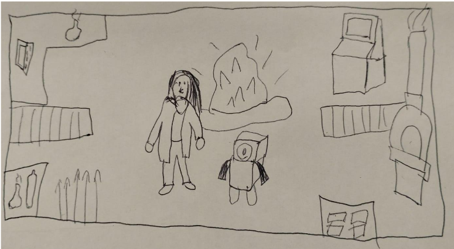 
Fonte: Autoria própria (2026).  

Figura 8: Concept Art do minigame do robô entre sucatas. 
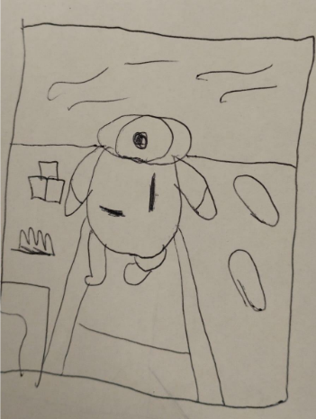 
Fonte: Autoria própria (2026).  

Figura 9: Concept Art do minigame de Visão Computacional. 
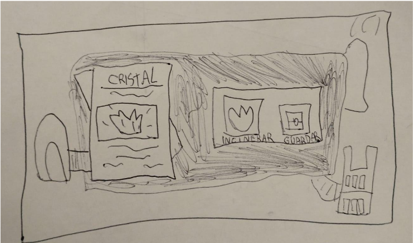 
Fonte: Autoria própria (2026).  

Figura 10: Concept Art do minigame de limpeza de Ruídos. 
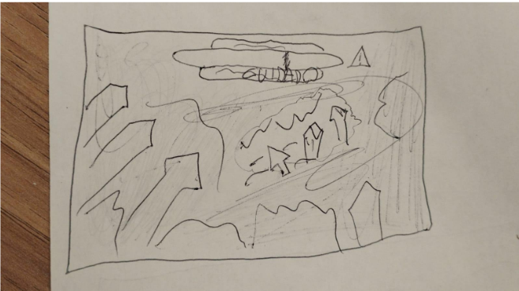 
Fonte: Autoria própria (2026).  

Figura 11: Primeira Concept Art de Asimov. 
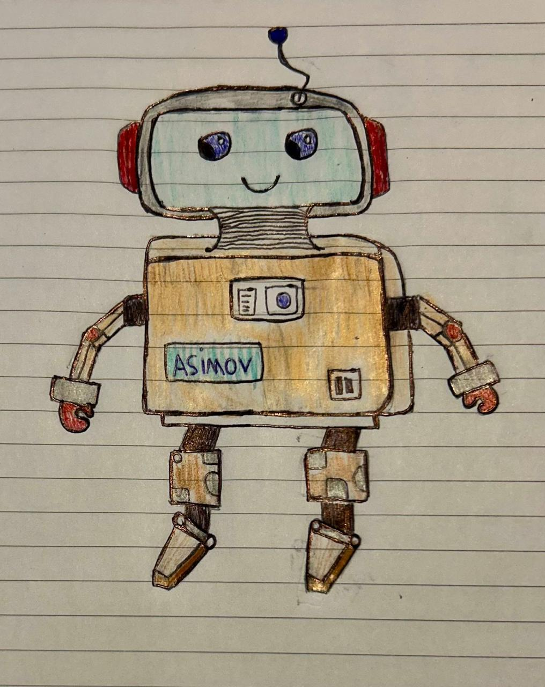 
Fonte: Autoria própria (2026).  

Figura 12: Segunda Concept Art de Asimov. 
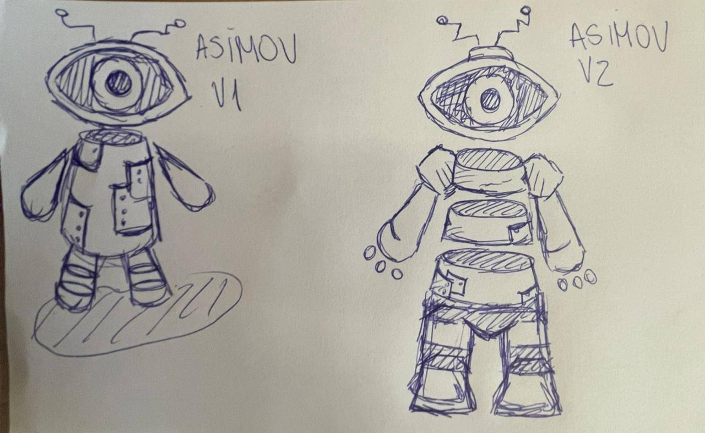 
Fonte: Autoria própria (2026).  

### 3.3.5. Trilha sonora (sprint 4)

Trilha sonora 1

Título                    Autoria               Ocorrência              Duração

Batida, tensa             Própria              Durante todas          32 segundos,
Futurista                                        as fases               em loop

DESCRIÇÃO 

A trilha sonora do jogo é um elemento de ambiente futurista, construída para colocar o jogador dentro de um universo tecnológico sombrio e instável. Ela não conta uma história, mas condiciona o estado emocional de quem joga, através de batidas metálicas que remetem a maquinário pesado e estruturas industriais, glitches e estáticos que lembram televisões analógicas falhando. Tudo isso junto passa a sensação de um futuro que existe, mas está quebrado. A tecnologia funciona, porém à beira do colapso, e o mundo ao redor respira de forma robotizada e fria.

Trilha sonora 2

Título                    Autoria               Ocorrência              Duração

Frequência Estável        Própria           durante os momentos          32 segundos, 
                                            que não tem desafios.          em loop

DESCRIÇÃO

É a música que toca enquanto Sophia ainda está descobrindo o que aconteceu e o que precisa fazer.O som continua sendo eletrônico e futurista, porque o mundo do jogo é assim, mas sem aquela sensação de perigo. As batidas são mais espaçadas, o ritmo é mais tranquilo. Dá pra sentir que as coisas ainda estão se encaixando, que existe uma chance de consertar tudo. É o som de um mundo quebrado que ainda tem esperança.

## 3.4. Inventário e Bestiário (sprint 3)

### 3.4.1. Inventário

\# | item |  | como obter | função 
--- | --- | --- | --- | --- 
1 | baú | 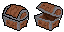 | estão em algumas fases do jogo | guardam recompensas e informações 
2 | envelope | 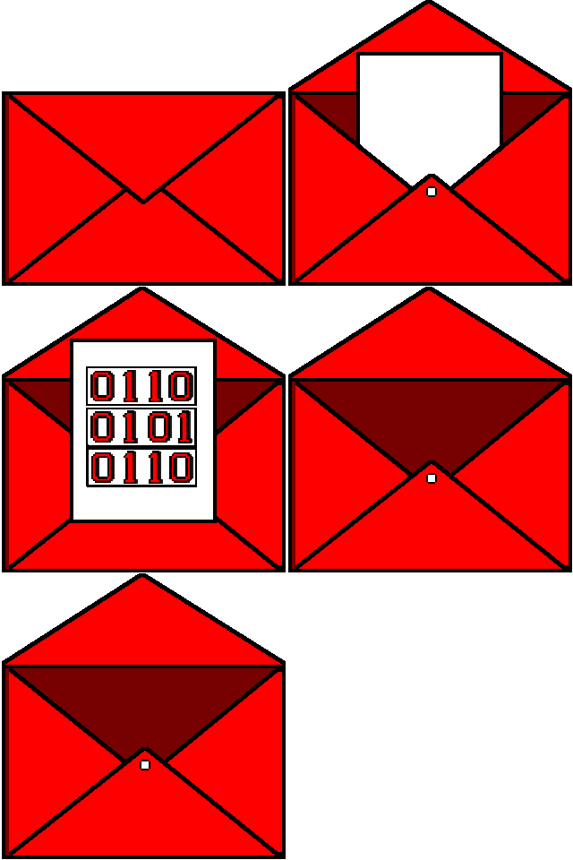 | estará no primeiro baú | dá informações que serão utiliazadas em uma fase futura
3 | pergaminho |  | estará no primeiro baú | dá informações sobre a história do jogo

### 3.4.2. Bestiário

A existência de inimigos não foi uma possibilidade acordada dentro do enredo do jogo devido ao grau de importância que o grupo concluiu para esse fator, pois o projeto trabalhado será mais focado na resolução de problemas lógicos.

## 3.5. Gameflow (Diagrama de cenas) (sprint 2)

Figura 13: Storyboard de programação 
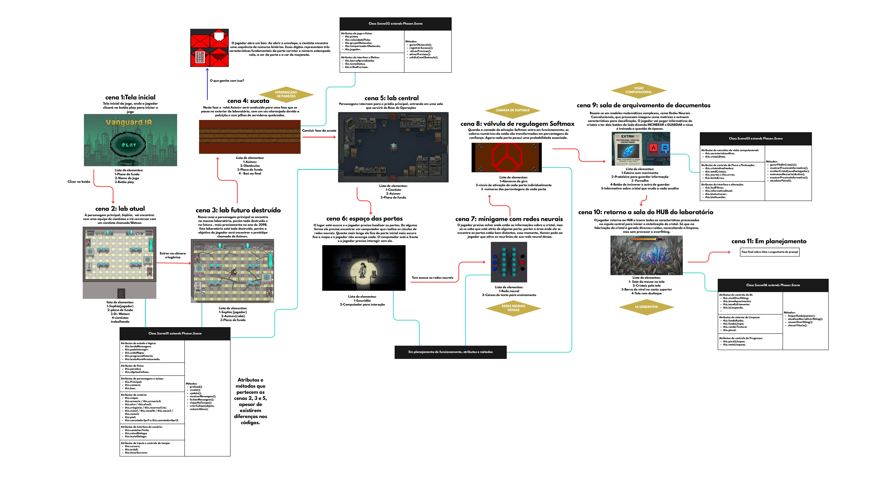 
Fonte: Autoria própria (2026). 

## 3.6. Regras do jogo (sprint 3)

O objetivo geral do jogo é investigar um laboratório em ruínas no ano de 2098 e forjar um novo núcleo de energia capaz de reativar o banco de dados do robô Asimov. No prólogo, ocorre um salto temporal em que o jogador viaja para o futuro e estabelece o primeiro contato com a máquina. Nesse momento inicial, a câmara criogênica permanece bloqueada, exigindo que o jogador interaja com o cientista Watson e esgote todas as opções de diálogo disponíveis para liberar a transição temporal. Ao chegar em 2098, a progressão só é habilitada após o jogador ouvir integralmente as instruções iniciais de Asimov, garantindo a compreensão do contexto e das mecânicas básicas.

Na sequência, a segunda etapa se desenrola em um corredor do laboratório, onde o jogador deve encontrar pistas sobre o cristal de energia. Para isso percorre um trajeto linear repleto de detritos, no qual a precisão é essencial, pois qualquer colisão com obstáculos resulta em falha imediata e reinício do percurso. Apenas ao completar a travessia sem erros o jogador desbloqueia um baú contendo as informações necessárias para avançar. Em seguida a progressão conduz a uma fase centrada no treinamento de uma rede neural, na qual o jogador precisa treinar Asimov para identificar a porta correta em meio à escuridão, interpretando a saída do sistema. As pistas coletadas anteriormente são utilizadas para alimentar os neurônios da rede densa de Asimov, mas os dados iniciais são apresentados de forma bruta e ilegível. Para torná los compreensíveis é necessário interagir diretamente com os neurônios de Asimov para ativá los um a um, além de encontrar e ativar manualmente a válvula softmax responsável por converter os valores em probabilidades entre 0 e 100. Com essa leitura clara o jogador deve então ajustar corretamente o limiar de confiança, valores inadequados impedem o reconhecimento da porta correta enquanto o ajuste preciso filtra as probabilidades irrelevantes e permite a progressão.

Na terceira fase, o jogador enfrenta um desafio de classificação de cristais após cair em um buraco, devendo escalá-lo enquanto coleta apenas os cristais verdadeiros, identificados pela cor azul, e evita os falsos, representados em vermelho. A coleta de um cristal incorreto implica penalização e reinício da fase, sendo necessário reunir todos os cristais corretos para prosseguir. Na quarta etapa, o foco recai sobre a limpeza de um cristal imperfeito gerado por Asimov, utilizando um mecanismo de arrasto com o mouse para remover manchas e irregularidades. Durante esse processo, o jogador deve controlar a barra de overfitting, impedindo que atinja 100%, pois isso resulta no reinício da fase; da mesma forma, uma limpeza incompleta impede a conclusão do objetivo. Por fim, na quinta e última fase, o jogador deve avaliar diferentes prompts sob critérios de adequação e ética, classificando-os como apropriados ou não. Para concluir o jogo, é necessário acertar pelo menos sete das dez avaliações apresentadas, consolidando o aprendizado adquirido ao longo da experiência.

## 3.7. Mecânicas do jogo (sprint 3)

### Mecânicas principais

As mecânicas do jogo envolvem exploração do ambiente, interação com objetos e resolução de desafios relacionados à inteligência artificial. O jogador controla os personagens para investigar o laboratório, coletar informações e completar tarefas necessárias para avançar nas fases.

1. Exploração do ambiente e Desvio de Obstáculos
O jogador pode se movimentar livremente dentro do mapa inicial para explorar o laboratório. Na área de sucatas, a exploração muda para o controle de Asimov em um percurso linear, onde é estritamente necessário desviar de detritos.

Controles de Exploração Livre (Sophia):

Tecla W / Seta para Cima: Move para cima (Eixo Y+). Tecla S / Seta para Baixo: Move para baixo (Eixo Y-). Tecla D / Seta para a Direita: Move para a direita (Eixo X+).Tecla A / Seta para a Esquerda: Move para a esquerda (Eixo X-).Barra de Espaço: Pular. Controles na Sucata (Asimov):Tecla W / Seta para Cima: Move para a faixa de cima. Tecla S / Seta para Baixo: Move para a faixa de baixo.Barra de Espaço: Saltar obstáculos.

2. Interação com objetos e sistemas
Utilizando a tecla de interação, o jogador pode acessar baús, arquivos, máquinas e terminais do laboratório, além de conversar com o cientista Watson e com Asimov. Esses elementos liberam informações da narrativa ou ativam desafios necessários para continuar a fase.

Controles: Tecla "E" para interagir com personagens, avançar nos diálogos e interagir com objetos.

3. Treinamento da rede neural de Asimov e Válvula Softmax
Com as pistas coletadas, o jogador inicia o treinamento da rede neural. É obrigatório encontrar e ativar a Válvula Softmax para converter os dados brutos em probabilidades, além de definir o limiar de confiança exato na interface para que Asimov identifique a porta.

Controles:

Mouse (Movimento) + Clique Único: Para selecionar e ativar os neurônios na tela além de servir para interagir e abrir a Válvula Softmax.

Clique e Arraste (Slider): Para ajustar a barra do "limiar de confiança" de 0 a 100% na interface.

4. Investigação e coleta de informações
Na sala de arquivos, o jogador encontra documentos e imagens de diferentes cristais armazenados em um baú. Essas informações ajudam a identificar quais cristais possuem as características corretas.

Controles: Interação padrão (Tecla "E") para abrir o baú e ler as pistas.

5. Classificação de cristais
Na sala da esteira, o jogador deve analisar imagens de cristais e realizar a classificação entre cristais verdadeiros e falsos.

Controles (Cliques na Interface):

Botão "Guardar" (Verde): Para cristais verdadeiros (azuis, brilhantes e pontiagudos).

Botão "Incinerar" (Vermelho): Para cristais falsos (com imperfeições ou coloração diferente).

6. Extração de características e Forja Generativa
Após selecionar corretamente os cristais verdadeiros, eles são enviados para um extrator de características, que gera uma matriz de características com os padrões do cristal correto. Em seguida, inicia-se a forja generativa, onde o jogador deve eliminar ativamente os "ruídos" (imperfeições visuais) gerados pelo processo.

Controles:

Tecla "E": Para ativar o terminal do extrator de características.

Clique e Arraste (Botão Esquerdo do Mouse): Clicar e segurar em cima do esfregão e arrastar o mouse por todo o ruído (manchas no cristal em formação) para limpar as falhas até preencher a barra de pureza em 100%.

7. Restauração do laboratório
Após a forja e a identificação correta do cristal verdadeiro, Sophia pode levá-lo até a sala principal de controle, onde o cristal é depositado no centro do sistema energético do laboratório, restaurando parte da energia e permitindo a continuidade da narrativa.

Controles: Movimentação livre (WASD / Setas) para transportar o cristal e Tecla "E" no núcleo central para depositá-lo e acionar a vitória da fase.

## 3.8. Implementação Matemática de Animação/Movimento (sprint 4)

## 3.8.1 Parâmetros do Modelo

| Símbolo | Descrição                        | Valor       |
|---------|----------------------------------|-------------|
| xᵢ      | Posição inicial X                | 1065 px     |
| yᵢ      | Posição inicial Y                | 235 px      |
| xf      | Posição final X                  | 861 px      |
| yf      | Posição final Y                  | 235 px      |
| T       | Duração total da animação        | 2 s         |
| aᵧ      | Aceleração gravitacional do jogo | 200 px/s²   |

> **Nota sobre coordenadas:** No Phaser 3 o eixo Y cresce **para baixo**.
> Velocidade inicial negativa em Y = movimento **para cima** na tela.
> Aceleração positiva em Y = gravidade puxando **para baixo**.

## 3.8.2 Eixo X — Movimento Uniforme (MU)

No MU a aceleração é nula e a velocidade é constante. Partindo da definição de velocidade média:

$$
v_x = \frac{x_f - x_i}{T} = \frac{861 - 1065}{2} = -102 \text{ px/s}
$$

Equação horária da posição em X:

$$
x(t) = x_i + v_x \cdot t
$$

**Verificação:** $x(2) = 1065 + (-102)(2) = 861 \text{ px}$ ✓

## 3.8.3 Eixo Y — Movimento Uniformemente Variado (MUV)

Como $y_i = y_f = 235$ px, a pedra executa um arco simétrico — sobe e retorna ao mesmo nível.

**Aceleração (parâmetro de projeto):**

$$
a_y = +200 \text{ px/s}^2
$$

**Velocidade inicial em Y** — obtida impondo $y(T) = y_f$ na equação horária:

$$
y(T) = y_i + v_{y0} \cdot T + \frac{1}{2} \cdot a_y \cdot T^2 = y_f
$$

$$
v_{y0} \cdot T = y_f - y_i - \frac{1}{2} \cdot a_y \cdot T^2
$$

$$
v_{y0} = \frac{(y_f - y_i) - \frac{1}{2} \cdot a_y \cdot T^2}{T} = \frac{0 - \frac{1}{2} \cdot 200 \cdot 4}{2} = -200 \text{ px/s}
$$

**Equação horária da velocidade em Y:**

$$
v_y(t) = v_{y0} + a_y \cdot t
$$

**Equação horária da posição em Y:**

$$
y(t) = y_i + v_{y0} \cdot t + \frac{1}{2} \cdot a_y \cdot t^2
$$

**Verificações:**
- Pico em $t = 1$ s: $y(1) = 235 + (-200)(1) + \frac{1}{2}(200)(1) = 135 \text{ px}$ → sobe 100 px ✓
- Retorno em $t = 2$ s: $y(2) = 235 + (-200)(2) + \frac{1}{2}(200)(4) = 235 \text{ px}$ ✓

# 3.8.4 Visualização das Trajetórias

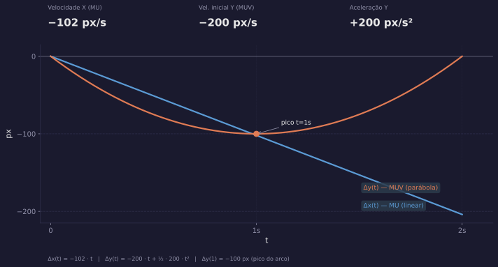

$$
\Delta x(t) = -102 \cdot t \quad | \quad \Delta y(t) = -200 \cdot t + \frac{1}{2} \cdot 200 \cdot t^2 \quad | \quad \Delta y(1) = -100 \text{ px (pico do arco)}
$$

# 3.8.5 Localização no Código-Fonte

- **Arquivo:** `faseTres.js`
- **Função:** launchStoneProjectile
- **Linhas de início:** linha 1 de 390 até linha 75 de 390; linha 183 de 390 até linha 188 de 390. 

# 3.8.6 Código — Implementação em Phaser 3 com JavaScript

Para acesso ao código direto para a linha do console.log da posição X, somente realizar o acesso a este link: https://git.inteli.edu.br/graduacao/2026-1a/t29/g03/-/blob/main/src/scenes/faseTres.js?ref_type=heads#L43

Para acesso ao código direto para a linha do console.log da posição Y, somente realizar o acesso a este link: https://git.inteli.edu.br/graduacao/2026-1a/t29/g03/-/blob/main/src/scenes/faseTres.js?ref_type=heads#L48

Para acesso ao código direto para a linha do inicio da função de matemática/física da bolinha, somente realizar o acesso a este link:https://git.inteli.edu.br/graduacao/2026-1a/t29/g03/-/blob/main/src/scenes/faseTres.js?ref_type=heads#L5

## 3.8.7 Tabela de Validação

| t (s) | x(t) px | vx (px/s) | y(t) px | vy(t) px/s | ay (px/s²) |
|-------|---------|-----------|---------|------------|------------|
| 0,000 | 1065,00 | −102,00   | 235,00  | −200,00    | 200,00     |
| 0,500 | 1014,00 | −102,00   | 185,00  | −100,00    | 200,00     |
| **1,000** | **963,00** | **−102,00** | **135,00** | **0,00** | **200,00** |
| 1,500 | 912,00  | −102,00   | 185,00  | +100,00    | 200,00     |
| 2,000 | 861,00  | −102,00   | 235,00  | +200,00    | 200,00     |

> Em **t = 1 s** (linha em negrito): $v_y = 0$ confirma o pico do arco.
> Em **t = 2 s**: $x = 861$ px e $y = 235$ px confirmam o retorno às coordenadas finais. ✓

Para garantir que a movimentação e a gravidade no jogo funcionem de maneira fluida e precisa, a lógica de programação foi estruturada com rigor científico. A modelagem matemática das equações de Movimento Uniforme (MU) e Movimento Uniformemente Variado (MUV) aplicadas ao motor gráfico foi baseada na obra Fundamentos de Física: Mecânica (HALLIDAY; RESNICK; WALKER, 2016)¹². Além disso, o suporte conceitual para a mecânica bidimensional e o cálculo exato de trajetórias parabólicas, como o tempo de voo e o impulso dos pulos, fundamentou-se no Curso de Física Básica: Mecânica (NUSSENZVEIG, 2013)¹³.

# 4. Desenvolvimento do Jogo

## 4.1. Desenvolvimento preliminar do jogo (sprint 1)

Na primeira sprint o grupo desenvolveu a versão inicial do jogo, tendo como foco os requisitos 1 e 2 do Game Design Document (GDD). A primeira versão é composta pela tela inicial, que contém o botão "Play" para que o jogador inicie o jogo.

No decorrer do desenvolvimento, foi construída a tela de uma das fases do jogo, em que o jogador poderá explorar a sala que o personagem está e interagir com um dos items.

Figura 14: Imagem do personagem da primeira fase. 
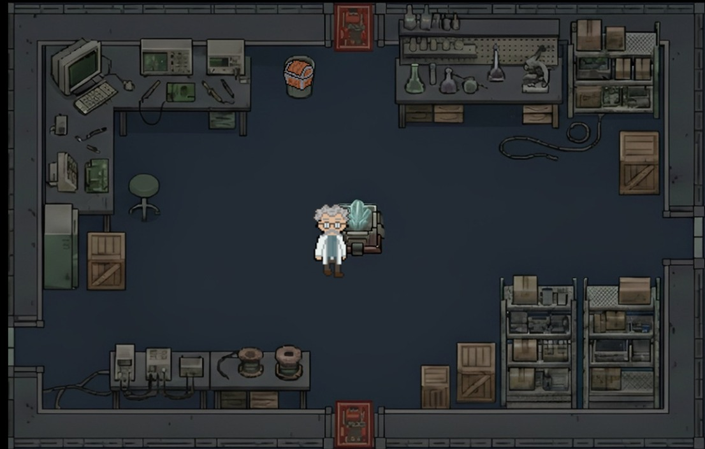 
Fonte: Autoria própria (2026).  

Figura 15: Imagem do personagem interagindo com um item. 
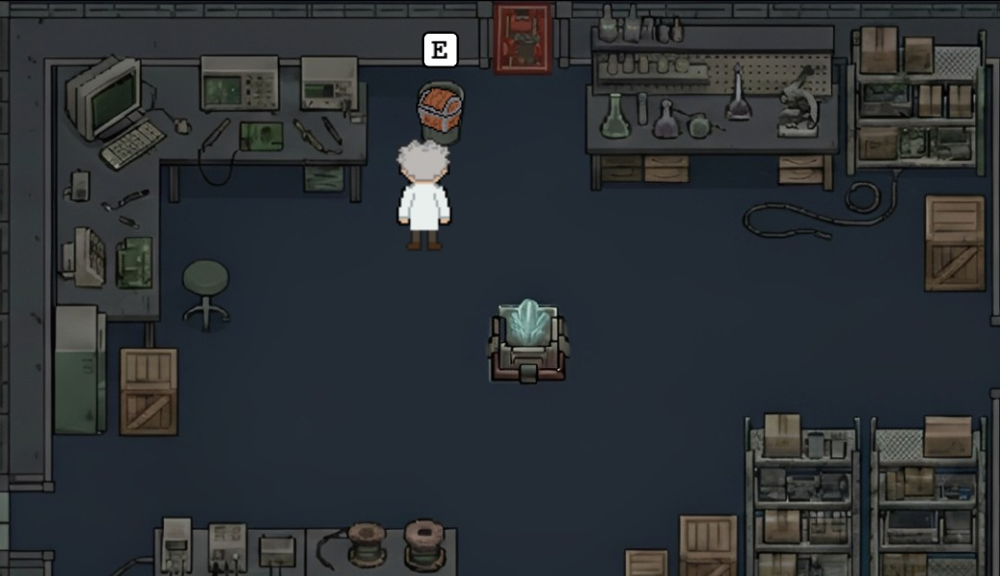 
Fonte: Autoria própria (2026).  

Nesta tela também foram implementados um sistema de colisão básico — em apenas alguns pontos da tela — e um balão de chat.

Figura 16: Imagem da matriz de colisão na primeira tela. 
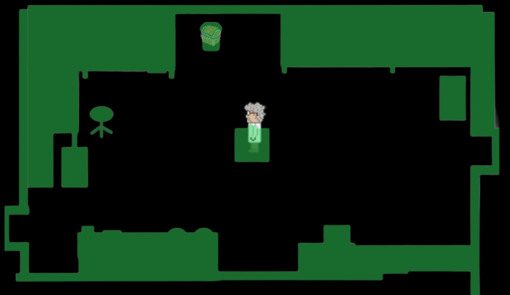 
Fonte: Autoria própria (2026).  

Figura 17: Imagem do balão de chat na tela. 
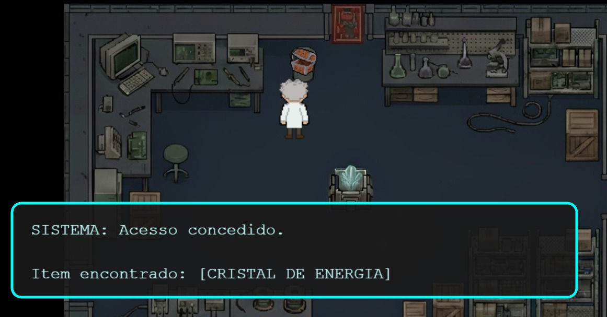 
Fonte: Autoria própria (2026).  

Para os próximos passos, o grupo deseja implementar os requisitos 3 e 4, adicionar novas fases para implemnetar os requisitos 5 e 6.

## 4.2. Desenvolvimento básico do jogo (sprint 2)

Na segunda sprint o desenvolvimento do jogo foi focado na implementação da tela inicial do jogo, na elaboração dos backgrounds e periféricos das fases e na correção de bugs.

No decorrer do desenvolvimento da segunda sprint, ocorreram alterações estéticas referentes aos cenários das cenas já existentes, que foram estruturados a partir de softwares voltados ao design em pixel art.

Figura 18: Imagem do Laboratório de Cristal ao começo do jogo. 
 
Fonte: Autoria própria (2026).  

Figura 19: Imagem do Laboratório de Cristal ao fim do jogo. 
 
Fonte: Autoria própria (2026).  

Além disso, foram refatorados: os sistemas de colisão para que, ao invés de utilizar um sistema baseado na detecção de diferentes cores, fosse utilizado funções de colisão do Phaser; e a mensagem de texto, para sugerir interação, e as caixas de diálogo, para que ficassem centralizadas e não atrapalhassem a jogabilidade.

Figura 20: Imagem do Laboratório da Cena 01 no jogo. 
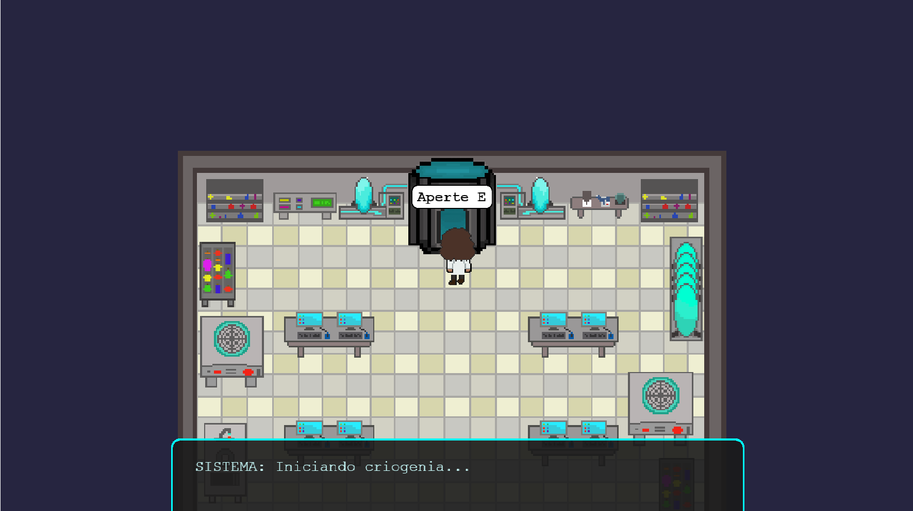 
Fonte: Autoria própria (2026).  

 

Por fim, foram desenvolvidos os designs do background utilizado na Fase 01 e dos objetos utilizados como obstáculos na cena.

Figura 21: Background utilizado na Fase 01. 
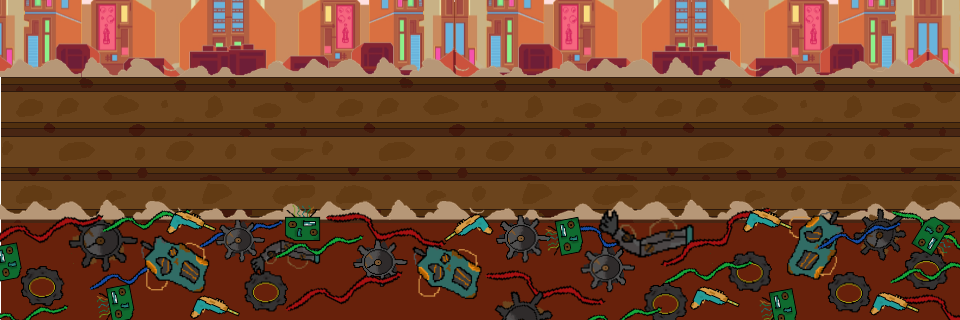 
Fonte: Autoria própria (2026).  

Figura 22: Objetos utilizados na Fase 01. 
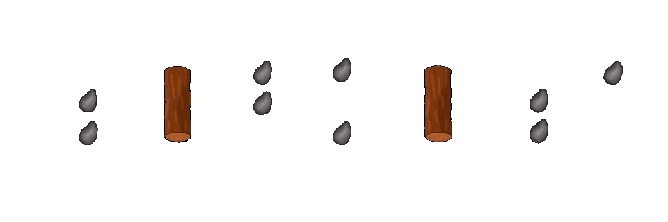 
Fonte: Autoria própria (2026).  

 

## 4.3. Desenvolvimento intermediário do jogo (sprint 3)
Durante a Sprint 3, a equipe concentrou-se na implementação de elementos narrativos e mecânicos fundamentais para o funcionamento do jogo. As atividades foram conduzidas de forma paralela entre os membros da equipe e posteriormente integradas para compor a versão intermediária do jogo entregue nesta etapa.

Uma das frentes de desenvolvimento foi a implementação do sistema de diálogos, responsável por contextualizar a narrativa e orientar o jogador. Foram criados balões de fala para os personagens Dr. Watson e Asimov, permitindo que as interações apresentem a situação do mundo e introduzam conceitos iniciais relacionados aos fundamentos da Inteligência Artificial. Esse sistema também estabelece a progressão narrativa entre o laboratório inicial, o despertar no futuro e o início da primeira fase.

Figura 23: Dialogo com Asimov no futuro. 
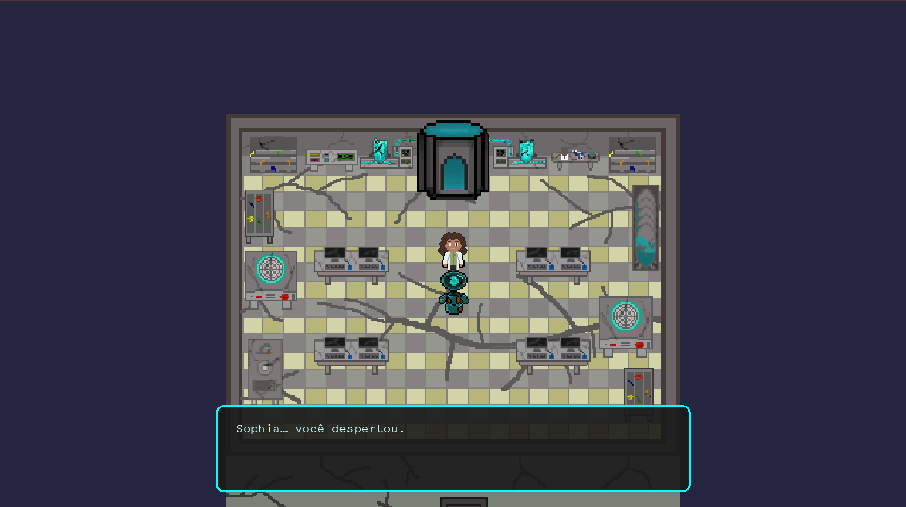 
Fonte: Autoria própria (2026).  

Paralelamente, foi realizada a criação e instanciação dos NPCs no laboratório inicial, adicionando cientistas ao cenário para tornar o ambiente mais dinâmico e reforçar a ambientação de um laboratório ativo no início da narrativa. Esses personagens ajudam a compor o contexto da história antes do evento de criogenia da protagonista.

*imagem do laboratório inicial com os NPCs

A Fase 1 foi implementada e apresenta o robô Asimov em um cenário destruído. O personagem avança automaticamente enquanto o jogador utiliza as setas do teclado para alternar entre três faixas do cenário e a tecla espaço para realizar saltos e evitar obstáculos. A interação com o ambiente utiliza um sistema de colisão baseado na leitura de pixels da imagem de obstáculos, que reinicia a posição do personagem em caso de impacto. Ao final do percurso, o jogador encontra um baú interativo, que ativa uma sequência narrativa responsável por dar continuidade à história.

Figura 24: Fase 1 
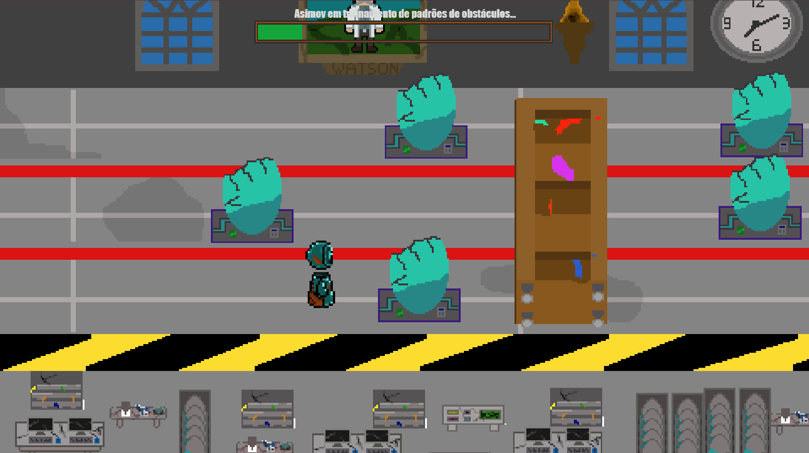 
Fonte: Autoria própria (2026).  

Também foi desenvolvida a cutscene do despertar de Sophia, responsável por conectar narrativamente o passado e o futuro do jogo. A animação apresenta o momento em que Asimov desperta Sophia da criogenia em um laboratório destruído, iniciando a nova etapa da história. A cutscene foi produzida em animação 2D quadro a quadro, utilizando técnicas como onion skinning, onde é possível ver os frames passados e futuros,  para garantir maior fluidez nos movimentos.

Figura 25: CutScene do despertar. 
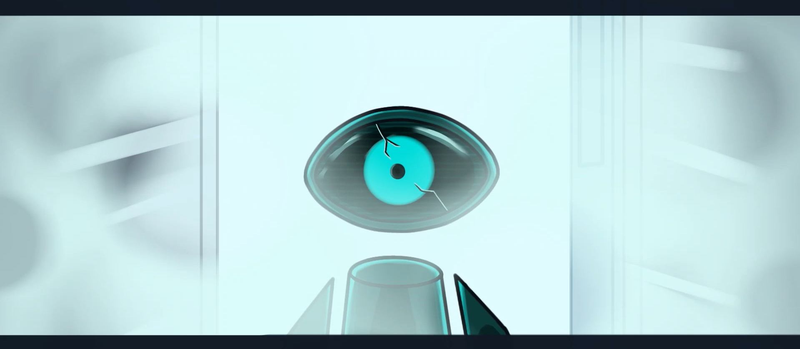 
Fonte: Autoria própria (2026).  

## 4.4. Desenvolvimento final do MVP (sprint 4)

## 4.5. Revisão do MVP (sprint 5)

*Descreva e ilustre aqui o desenvolvimento dos refinamentos e revisões da versão final do jogo, explicando brevemente o que foi entregue em termos de MVP. Utilize prints de tela para ilustrar.*

# 5. Testes

## 5.1. Casos de Teste (sprints 2 a 4)

| pré-condição                          | descrição do teste                              | pós-condição                                              |
|----------------------------------------|--------------------------------------------------|-----------------------------------------------------------|
| jogo iniciado                     | pressionar setas                 | personagem se move corretamente nas direções designadas |
| personagem próximo a obstáculo/colisão| movimentar personagem contra a parede/objeto   | personagem não atravessa a parede ou o objeto            |
| estar perto do personagem Watson | pressionar tecla E | caixa de diálogo e textos são exibidos na tela |
| função de diálogo ativada | pressionar tecla E | mudança do texto exibido na caixa de diálogo |
| explicação por personagem finalizada | pressionar tecla E | caixa de diálogo para de ser exibida |
| ter interagido com o personagem Watson e estar próximo da câmara criogência | pressionar tecla E | aparece vídeo de transição e ser transportado para o laboratório no futuro |
| estar próximo de personagem Asimov | pressionar tecla E | caixa de diálogo e textos são exibidos na tela |
| estar na fase 01 | apertar tecla SPACE | personagem deve pular corretamente |
| estar na fase 01 | colidir com obstáculo | reiniciar fase 01 |

## 5.2. Testes de jogabilidade (playtests) (sprint 5)

### 5.2.1 Registros de testes

*Teste de Guerrilha*

Nome | Felipe 
--- | ---
Já possuía experiência prévia com games? | Sim, é um jogador casual
Conseguiu iniciar o jogo? | Não
Entendeu as regras e mecânicas do jogo? | Sim, entendeu em partes
Conseguiu progredir no jogo? | Sim  
Apresentou dificuldades? | Sim
Que nota deu ao jogo? | 7.0
O que gostou no jogo? | Os mini games
O que poderia melhorar no jogo? | O personagem poderia se mover mais rápido. Bug da sala do cristal. Limpar o cristal com cliques não sobe a barra. Na questão das perguntas ele respondeu uma errado e deu certo

Nome | Luis 
--- | ---
Já possuía experiência prévia com games? | Sim, é um jogador casual
Conseguiu iniciar o jogo? | Sim
Entendeu as regras e mecânicas do jogo? | Sim, entendeu em partes
Conseguiu progredir no jogo? | Sim  
Apresentou dificuldades? | Sim
Que nota deu ao jogo? | 9.0
O que gostou no jogo? | Design e animações
O que poderia melhorar no jogo? | Colocar indicadores para orientar o jogador sobre o que deve fazer, reduzindo a necessidade de explicações longas. Diminuir principalmente os textos dos documentos, já que fogem da proposta do jogo, que deve ser mais lúdica. Se o conteúdo dos papéis não tiver função prática na jogabilidade, não há necessidade de mantê-los. Além disso, melhorar o áudio: conforme o diálogo avança, inserir sons adequados, como efeitos de pulo e interação, para enriquecer a experiência

Nome | João 
--- | ---
Já possuía experiência prévia com games? | Sim, é um jogador casual
Conseguiu iniciar o jogo? | Sim
Entendeu as regras e mecânicas do jogo? | Sim, entendeu em partes
Conseguiu progredir no jogo? | Sim  
Apresentou dificuldades? | Sim
Que nota deu ao jogo? | 8.0
O que gostou no jogo? | Gostou do Asimov e da dinâmica de explicação com o mesmo. Gostou da história, da ideia de que você está no laboratório e você precisa salvar o mundo
O que poderia melhorar no jogo? | Substituir assets que parecem não combinar com o jogo. Correção de bug entre a parede e o baú. Melhorar a explicação das mecânicas (especialmente algumas serem com o mouse e outras com o E). Explicar melhor sobre os prompts e selecionar eles com a setinha e não com o mouse. Criar uma tela de finalização do jogo. Diminuir textos muito longos e monótonos

Nome | Manuela 
--- | ---
Já possuía experiência prévia com games? | Sim, é um jogador casual
Conseguiu iniciar o jogo? | Não
Entendeu as regras e mecânicas do jogo? | Sim, entendeu em partes
Conseguiu progredir no jogo? | Sim  
Apresentou dificuldades? | Sim
Que nota deu ao jogo? | 8.0
O que gostou no jogo? | A historia ficou muito boa
O que poderia melhorar no jogo? | Mecânicas e teclas. O ultimo baú ela interagiu e não apareceu nada, Sophia por cima do papel e muito texto

Nome | Augusto 
--- | ---
Já possuía experiência prévia com games? | Sim, é um jogador casual
Conseguiu iniciar o jogo? | Sim
Entendeu as regras e mecânicas do jogo? | Sim, entendeu em partes
Conseguiu progredir no jogo? | Sim  
Apresentou dificuldades? | Sim
Que nota deu ao jogo? | 7.0
O que gostou no jogo? | O aprendizado está bem desenvolvido, com um bom equilíbrio entre design e informações. Os minigames são bem feitos e divertidos, especialmente nas partes como o cérebro do robô, contribuindo positivamente para a experiência geral de aprendizado no jogo. A movimentação do personagem também está muito boa — o pulo e a velocidade estão bem ajustados, tornando a jogabilidade fluida e agradável. Além disso, o cenário é interessante e interativo, com diversos objetos que enriquecem a exploração
O que poderia melhorar no jogo? | Há excesso de texto nas conversas, e não está claro qual personagem está falando. Uma solução é diferenciar as falas usando cores distintas nas caixas de diálogo, facilitando a identificação. Os arquivos da copiadora também estão muito grandes, o que acaba prejudicando a imersão do jogador. Além disso, os prompts não estão claros e acabam gerando confusão. No parkour, é importante deixar explícito que, ao pegar o item falso, o jogo deve ser reiniciado. Seria interessante adicionar uma cutscene de transição após o parkour, mostrando o personagem escalando até chegar à parte do baú. As transições, de modo geral, estão confusas e com informação demais em texto, o que quebra o ritmo do jogo — é importante reduzir e distribuir melhor essas informações. O cenário também pode ser mais conectado e exploratório, pois atualmente as áreas parecem soltas e pouco intuitivas. Tornar a progressão das fases mais linear pode ajudar na compreensão do jogador. Por fim, ajustar a contagem de acertos da fase 5 para 10 e, no geral, reduzir a quantidade de informação apresentada ao jogador para melhorar a experiência

Nome | Rafael 
--- | ---
Já possuía experiência prévia com games? | Sim, é um jogador casual
Conseguiu iniciar o jogo? | Sim
Entendeu as regras e mecânicas do jogo? | Sim, entendeu em partes
Conseguiu progredir no jogo? | Sim  
Apresentou dificuldades? | Sim
Que nota deu ao jogo? | 7.5
O que gostou no jogo? | Gostou da história do jogo (o que mais prendeu ele). Gostou da variedade de minigames
O que poderia melhorar no jogo? | Não entendia o que devia ser feito em alguns momentos do jogo (instruções vagas). Sofreu com lag. Diminuir a quantidade de texto dos diálogos

Nome | Ana 
--- | ---
Já possuía experiência prévia com games? | Sim, é um jogador casual
Conseguiu iniciar o jogo? | Sim
Entendeu as regras e mecânicas do jogo? | Sim, entendeu em partes
Conseguiu progredir no jogo? | Sim  
Apresentou dificuldades? | Sim
Que nota deu ao jogo? | 9.0
O que gostou no jogo? | Os minigames foram muito bem elogiados, destacando-se como um dos pontos fortes do jogo
O que poderia melhorar no jogo? | Algumas partes apresentam excesso de texto, o que pode prejudicar o ritmo do jogo. É recomendável resumir as informações e torná-las mais objetivas, especialmente no início, para não sobrecarregar o jogador logo nos primeiros momentos

Nome | Raissa 
--- | ---
Já possuía experiência prévia com games? | Não
Conseguiu iniciar o jogo? | Sim
Entendeu as regras e mecânicas do jogo? | Sim, entendeu em partes
Conseguiu progredir no jogo? | Sim  
Apresentou dificuldades? | Sim
Que nota deu ao jogo? | 7.0
O que gostou no jogo? | O jogo realmente ensina os conceitos de IA, apresentando um bom nível de aprofundamento nos diálogos. Por isso, eles acabam sendo um pouco mais longos. Além disso, o jogo possui uma certa complexidade e consegue engajar o jogador, já que as fases são variadas entre si. Isso é um ponto positivo, pois evita que a experiência se torne monótona
O que poderia melhorar no jogo? | Em relação a melhorias, acredito que o jogo poderia incluir instruções mais claras sobre como navegar e sobre as regras. Por exemplo, na parte em que o personagem precisa pular, inicialmente não fica evidente essa ação — pode-se pensar que ele atravessaria o portal automaticamente. Também há um bug em que o personagem atravessa o robô, o que prejudica a experiência. Outro ponto é em relação aos diálogos geradas por IA, sendo interessante revisá-los e reduzir um pouco o tamanho dos textos, pois a leitura pode se tornar cansativa

*Formulário de teste de feedback de usuários - Vanguard.IA*

Número formulário | 1 
--- | ---
Qual a faixa sua etária? | 19 a 20 anos
Com qual gênero você se identifica? | Homem
Em que ano da faculdade você se encontra? | 1º ano
Qual a sua relação com jogo e vídeo games? | Jogo casualmente, algumas vezes na semana
O jogo foi frustrante ou irritante? (1 a 5) - 1 discordo totalmente e 5 concordo totalmente | 2
O jogo foi entediante ou cansativo? (1 a 5) - 1 discordo totalmente e 5 concordo totalmente | 3
O jogo foi confuso ou desconexo? (1 a 5) - 1 discordo totalmente e 5 concordo totalmente | 2
Qual sua nota para nosso jogo? (1 a 10) | 7
Achei o objetivo do jogo confuso? (1 a 5) - 1 discordo totalmente e 5 concordo totalmente | 2
Achei os comandos e interações confusos? (1 a 5) - 1 discordo totalmente e 5 concordo totalmente | 3
Os controles do jogo são desconfortáveis ou atrapalham a jogar? (1 a 5) - 1 discordo totalmente e 5 concordo totalmente | 1
O objetivo do jogo é claro e faz sentido? (1 a 5) - 1 discordo totalmente e 5 concordo totalmente | 4
Os minigames do jogo possuem comandos claros? (1 a 5) - 1 discordo totalmente e 5 concordo totalmente | 5
Qual foi o melhor momento do jogo? | O minigames de limpar as informações
Qual foi o pior momento do jogo? | A parte final onde não houve instrução do que fazer
Você precisou de ajuda ou instrução e algum momento do jogo? Por quê? | Sim, porque não ficou claro o que fazer na parte do baú no final
Se você pudesse alterar, adicionar ou retirar algo do jogo, o quê seria? (Pergunta opcional) | Adicionar algo no baú final e aumentar a velocidade do jogador
Você conseguiu aprender com o jogo? (1 a 5) - 1 discordo totalmente e 5 concordo totalmente | 5
O que você achou do processo de aprendizado do jogo? | Legal

### 5.2.2 Melhorias

*Descreva nesta seção um plano de melhorias sobre o jogo, com base nos resultados dos testes de jogabilidade*

# 6. Conclusões e trabalhos futuros (sprint 5)

*Escreva de que formas a solução do jogo atingiu os objetivos descritos na seção 1 deste documento. Indique pontos fortes e pontos a melhorar de maneira geral.*

*Relacione os pontos de melhorias evidenciados nos testes com plano de ações para serem implementadas no jogo. O grupo não precisa implementá-las, pode deixar registrado aqui o plano para futuros desenvolvimentos.*

*Relacione também quaisquer ideias que o grupo tenha para melhorias futuras*

# 7. Referências (sprint 5)

¹ ABRA. A indústria de games BR e o nicho de jogos educativos. Disponível em: https://abra.com.br/artigos/a-industria-de-games-br-e-o-nicho-de-jogos-educativos. Acesso em: 27 fev. 2026.

² AMAZON WEB SERVICES. AWS DeepRacer. Disponível em: https://aws.amazon.com/pt/deepracer/. Acesso em: 27 fev. 2026.

³ GOOGLE CLOUD. Google Cloud Skills Boost. Disponível em: https://www.cloudskillsboost.google/. Acesso em: 27 fev. 2026.

⁴ CENTRO PAULA SOUZA. CPS lança curso livre online gratuito sobre inteligência artificial. Disponível em: https://www.cps.sp.gov.br/cps-lanca-curso-livre-online-gratuito-sobre-inteligencia-artificial/. Acesso em: 27 fev. 2026.

⁵ ZAKI, Adam. Less than a third of companies follow AI adoption best practices. CFO.com, 2025. Disponível em: https://www.cfo.com/news/less-than-third-of-companies-following-all-of-mckinseys-ai-best-practices-/742279/. Acesso em: 27 fev. 2026.

⁶ NORONHA, Heloísa. Rede pública x rede privada: onde estudam os brasileiros, conforme o IBGE. CNN Brasil, 2025. Disponível em: https://www.cnnbrasil.com.br/educacao/rede-publica-x-rede-privada-onde-estudam-os-brasileiros-conforme-o-ibge/. Acesso em: 27 fev. 2026.

⁷ EXAME. A carreira de IA que ninguém te contou e pode pagar até R$ 1,5 milhão por ano. Exame, 2025. Disponível em: https://exame.com/carreira/a-carreira-de-ia-que-ninguem-te-contou-e-pode-pagar-ate-rs-150-mil-por-ano/. Acesso em: 27 fev. 2026.

⁸ MARKET DATA FORECAST. Gamification education market. Disponível em: https://www.marketdataforecast.com/market-reports/gamification-education-market. Acesso em: 27 fev. 2026.

⁹ SILVA, R. F. da; RODRIGUES, N. A. P.; TOMAZINI, S. M. Um Jogo para Apoiar o Ensino de Conceitos de IA e Visão Computacional na Educação Básica. RENOTE, 2026. Disponível em: https://seer.ufrgs.br/index.php/renote/article/view/153558. Acesso em: 27 mar. 2026.

¹⁰ MICROSOFT. Teaching AI Development Through Gamification. Microsoft Tech Community, 2026. Disponível em: https://techcommunity.microsoft.com/blog/azuredevcommunityblog/teaching-ai-development-through-gamification/4490755. Acesso em: 27 mar. 2026.

¹¹ MENDONÇA, A. P. B.; ALVES, L. R. G. Cursos Online Abertos e Massivos (MOOC) em contextos corporativos: uma revisão da literatura. Texto Livre, 2024. Disponível em: https://www.scielo.br/j/tl/a/RFbMyKKQGVfWxcTNFy8FLpn/?lang=pt. Acesso em: 27 mar. 2026.

¹² HALLIDAY, D.; RESNICK, R.; WALKER, J. Fundamentos de Física — Mecânica. Vol. 1, cap. 4. 10ª ed. LTC, 2016.

¹³ NUSSENZVEIG, H. M. Curso de Física Básica — Mecânica. Vol. 1, cap. 3. 5ª ed. Blucher, 2013.

¹⁴ GOODFELLOW, I.; BENGIO, Y.; COURVILLE, A. Deep Learning. Cambridge: MIT Press, 2016. Disponível em: https://www.deeplearningbook.org. Acesso em: 27 mar. 2026.

¹⁵ UNESCO. Recomendação sobre a ética da inteligência artificial. Paris: UNESCO, 2022. Disponível em: https://unesdoc.unesco.org/ark:/48223/pf0000381137_por. Acesso em: 27 mar. 2026.

¹⁶ AMAZON WEB SERVICES. O que é visão computacional? Disponível em: https://aws.amazon.com/pt/what-is/computer-vision/. Acesso em: 27 mar. 2026.

¹⁷ Fundação Instituto de Administração. Net Promoter Score (NPS): o que é, como calcular e exemplos. Disponível em: https://fia.com.br/blog/net-promoter-score-nps/. Acesso em: 6 abr. 2026.

# Anexos

*Inclua aqui quaisquer complementos para seu projeto, como diagramas, imagens, tabelas etc. Organize em sub-tópicos utilizando headings menores (use ## ou ### para isso)*
